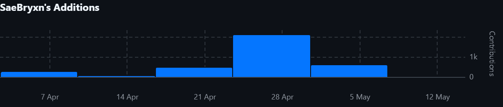
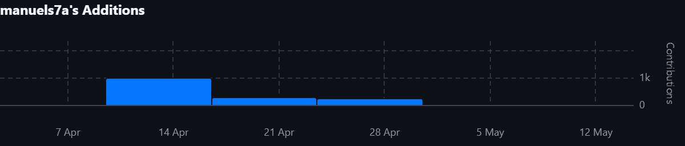
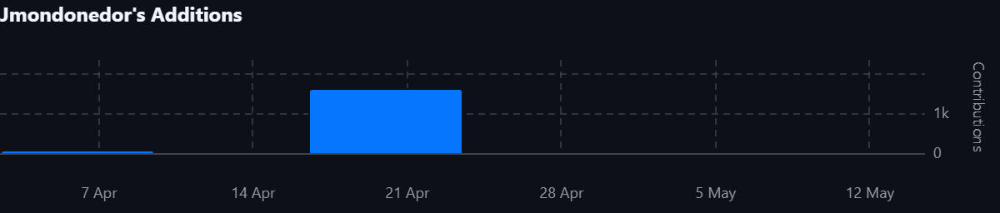
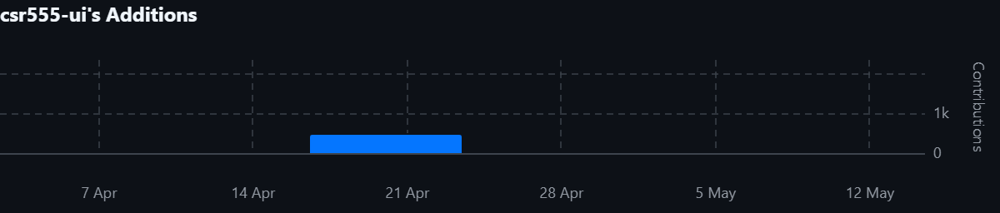
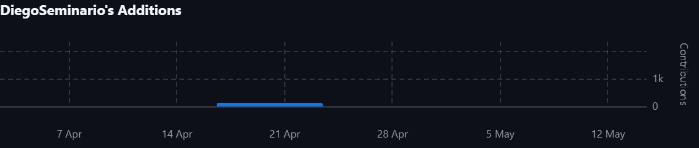
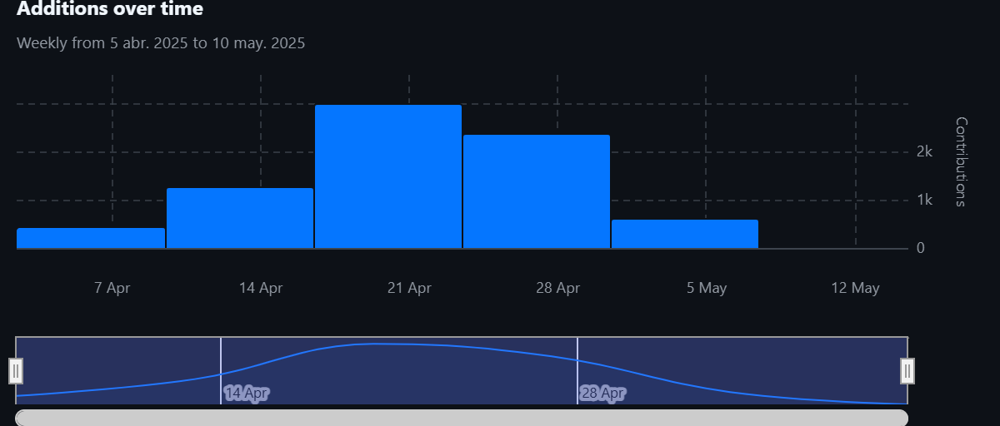

  
  
  <h2>Universidad: Universidad Peruana de Ciencias Aplicadas</h2>
  
<strong>Carrera:</strong> Ingeniería de Software

  
<strong>Ciclo:</strong> 2025-10

  
<strong>Código del Curso y Nombre del Curso:</strong> 1ASI0730 - Aplicaciones Web

  
<strong>Sección:</strong> 4374

  
<strong>Profesor:</strong> Alberto Wilmer Sánchez Seña

  <h3>Informe de Trabajo Final</h3>

  
<strong>Startup:</strong> FuelTrack

  
<strong>Nombre del Producto:</strong> FuelTrack Pro

<h3 align="center">Relación de Integrantes:</h3>

  <table>
    <tr>
      <th><strong>Código</strong></th>
      <th><strong>Apellidos y Nombres</strong></th>
    </tr>
    <tr>
      <td>u202213278</td>
      <td>Bryan Ronald Espejo Gamarra</td>
    </tr>
    <tr>
      <td>u201817507</td>
      <td>Manuel Angel Sanchez Arenas</td>
    </tr>
    <tr>
      <td>U202110373</td>
      <td>Juan Diego Javier Mondoñedo Rodriguez</td>
    </tr>
    <tr>
      <td>u202412591</td>
      <td>Diego Vicente Seminario Castillo</td>
    </tr>
    <tr>
      <td>u202310129</td>
      <td>César Augusto Navarro Correa</td>
    </tr>
  </table>

<strong>Mes y Año:</strong> Abril 2025

## Registro de Versiones del Informe

| **Versión** | **Fecha**   | **Autores**                                                                                     | **Descripción de Modificación**                                                                                                                                                                  |
|-------------|-------------|--------------------------------------------------------------------------------------------------|---------------------------------------------------------------------------------------------------------------------------------------------------------------------------------------------------|
| TB1       | 26/04/2025  | - Bryan Ronald Espejo Gamarra    - Manuel Ángel Sánchez Arenas    - Juan Diego Javier Mondoñedo Rodríguez   - Diego Vicente Seminario Castillo   - César Augusto Navarro Correa | Se incluyeron los siguientes capítulos:  • Estructura del informe  • Capítulo I: Introducción  • Capítulo II: Requirements Elicitation & Analysis  • Capítulo III: Requirements Specification  • Capítulo IV: Product Design  • Capítulo V: Product Implementation, Validation & Deployment  • Configuración inicial del repositorio y del Landing Page  • Aplicación de GitFlow y convenciones de commits |
| TP1       | 26/04/2025  | - Bryan Ronald Espejo Gamarra    - Manuel Ángel Sánchez Arenas    - Juan Diego Javier Mondoñedo Rodríguez   - Diego Vicente Seminario Castillo   - César Augusto Navarro Correa | Se incluyeron los siguientes capítulos:  • Cambios y mejoras del informe de la anterior versión  • Capítulo V: Product Implementation, Validation & Deployment (Sprint 2) • Frontend   • Configuración del repositorio Frontend  • Aplicación de GitFlow y convenciones de commits |
| TB2       | 21/06/2025  | - Bryan Ronald Espejo Gamarra    - Manuel Ángel Sánchez Arenas    - Juan Diego Javier Mondoñedo Rodríguez   - Diego Vicente Seminario Castillo   - César Augusto Navarro Correa | Se incluyeron los siguientes capítulos:  • Coordinacion de avance del backend, correcciones de Frontend.  • Entrevista a segmento proveedor y modulo Princing del backend  • Evaluaciones Heuristicas, video y conclusiones •  • Implementation, Validation & Deployment, Actualización de las evidencias colaborativas. |
| TF       | 07/07/2025  | - Bryan Ronald Espejo Gamarra    - Manuel Ángel Sánchez Arenas    - Juan Diego Javier Mondoñedo Rodríguez   - Diego Vicente Seminario Castillo   - César Augusto Navarro Correa | Se incluyeron las siguientes modificaciones:  • Actualizar links de despliegue en informe y realización de About the Product • Coordinación de cambios en Sprint 4 y anexos  • Revisión de los cambios generales en el informe  • Revisión de estructura y corroborar evidencia actualizada. • Colaboración en documnentar el Sprint 4 |

---
## Project Report Collaboration Insights

**Link del repositorio del informe:**  
[https://github.com/1ASI0730-2510-4374-G3-FuelTrack/report](https://github.com/1ASI0730-2510-4374-G3-FuelTrack/report)

**Link de los repositorios de la organización:**  
[https://github.com/orgs/1ASI0730-2510-4374-G3-FuelTrack/repositories](https://github.com/orgs/1ASI0730-2510-4374-G3-FuelTrack/repositories)

Este informe ha sido desarrollado de forma colaborativa mediante GitHub, aplicando GitFlow y Conventional Commits. Cada integrante del equipo ha contribuido mediante ramas independientes, commits individuales y revisiones de Pull Requests.

---

### 📊 Participación por miembro (commits realizados)

A continuación, se muestra un gráfico de barras con la cantidad de commits realizados por cada integrante del equipo:

---

### 📈 Evolución temporal de commits

El siguiente gráfico muestra una línea de tiempo con la evolución de los commits realizados por todos los miembros:

---

## Contenido

- [Carátula](#carátula)
- [Registro de Versiones del Informe](#registro-de-versiones-del-informe)
- [Project Report Collaboration Insights](#project-report-collaboration-insights)
- [Contenido](#contenido)
- [Student Outcome](#student-outcome)
- [Capítulo I: Introducción](#capítulo-i-introducción)
  - [1.1 Startup Profile](#11-startup-profile)
    - [1.1.1 Descripción de la Startup](#111-descripción-de-la-startup)
    - [1.1.2 Perfiles de integrantes del equipo](#112-perfiles-de-integrantes-del-equipo)
  - [1.2 Solution Profile](#12-solution-profile)
    - [1.2.1 Antecedentes y problemática](#121-antecedentes-y-problemática)
    - [1.2.2 Lean UX Process](#122-lean-ux-process)
      - [1.2.2.1 Lean UX Problem Statements](#1221-lean-ux-problem-statements)
      - [1.2.2.2 Lean UX Assumptions](#1222-lean-ux-assumptions)
      - [1.2.2.3 Lean UX Hypothesis Statements](#1223-lean-ux-hypothesis-statements)
      - [1.2.2.4 Lean UX Canvas](#1224-lean-ux-canvas)
  - [1.3 Segmentos objetivo](#13-segmentos-objetivo)
- [Capítulo II: Requirements Elicitation & Analysis](#capítulo-ii-requirements-elicitation--analysis)
  - [2.1 Competidores](#21-competidores)
    - [2.1.1 Análisis competitivo](#211-análisis-competitivo)
    - [2.1.2 Estrategias y tácticas frente a competidores](#212-estrategias-y-tácticas-frente-a-competidores)
  - [2.2 Entrevistas](#22-entrevistas)
    - [2.2.1 Diseño de entrevistas](#221-diseño-de-entrevistas)
    - [2.2.2 Registro de entrevistas](#222-registro-de-entrevistas)
    - [2.2.3 Análisis de entrevistas](#223-análisis-de-entrevistas)
  - [2.3 Needfinding](#23-needfinding)
    - [2.3.1 User Personas](#231-user-personas)
    - [2.3.2 User Task Matrix](#232-user-task-matrix)
    - [2.3.3 User Journey Mapping](#233-user-journey-mapping)
    - [2.3.4 Empathy Mapping](#234-empathy-mapping)
    - [2.3.5 As-is Scenario Mapping](#235-as-is-scenario-mapping)
  - [2.4 Ubiquitous Language](#24-ubiquitous-language)
-[Capítulo III: Requirements Specification](#capítulo-iii-requirements-specification)
  - [3.1 To-Be Scenario Mapping](#31-to-be-scenario-mapping)
  - [3.2 User Stories](#32-user-stories)
  - [3.3 Impact Mapping](#33-impact-mapping)
  - [3.4 Product Backlog](#34-product-backlog)
-[Capítulo IV: Product Design](#capítulo-iv-product-design)
  - [4.1 Style Guidelines](#41-style-guidelines)
    - [4.1.1 General Style Guidelines](#411-general-style-guidelines)
    - [4.1.2 Web Style Guidelines](#412-web-style-guidelines)
  - [4.2 Information Architecture](#43-information-architecture)
    - [4.2.1 Organization Systems](#421-organization-systems)
    - [4.2.2 Labeling System](#422-labeling-system)
    - [4.2.3 SEO Tags and Meta Tags](#423-seo-tags-and-meta-tags)
    - [4.2.4 Searching Systems](#424-searching-systems)
    - [4.2.5 Navigation System](#425-navigation-system)
  - [4.3 Landing Page UI Design](#43-landing-page-ui-design)
    - [4.3.1 Landing Page Wireframe](#431-landing-page-wireframe)
    - [4.3.2 Landing Page Mock-up](#432-landing-page-mock-up)
  - [4.4 Web Applications UX/UI Design](#44-web-applications-uxui-design)
    - [4.4.1 Web Applications Wireframes](#441-web-applications-wireframes)
    - [4.4.2 Web Applications Mock-ups](#442-web-applications-mock-ups)
    - [4.4.3 Web Applications User Flow Diagrams](#443-web-applications-user-flow-diagrams)
  - [4.5 Web Applications Prototyping](#45-web-applications-prototyping)
  - [4.6 Domain-Driven Software Architecture](#46-domain-driven-software-architecture)
    - [4.6.1 Software Architecture Context Diagram](#461-software-architecture-context-diagram)
    - [4.6.2 Software Architecture Container Diagrams](#462-software-architecture-container-diagrams)
    - [4.6.3 Software Architecture Components Diagrams](#463-software-architecture-components-diagrams)
  - [4.7 Software Object-Oriented Design](#47-software-object-oriented-design)
    - [4.7.1 Class Diagrams](#471-class-diagrams)
    - [4.7.2 Class Dictionary](#472-class-dictionary)
  - [4.8 Database Design](#48-database-design)
    - [4.8.1 Database Diagram](#481-database-diagram)
- [Capítulo V: Product Implementation, Validation & Deployment](#capítulo-v-product-implementation-validation--deployment)
  - [5.1 Software Configuration Management](#51-software-configuration-management)
    - [5.1.1 Software Development Environment Configuration](#511-software-development-environment-configuration)
    - [5.1.2 Source Code Management](#512-source-code-management)
    - [5.1.3 Source Code Style Guide & Conventions](#513-source-code-style-guide--conventions)
    - [5.1.4 Software Deployment Configuration](#514-software-deployment-configuration)
  - [5.2 Landing Page, Services & Applications Implementation](#52-landing-page-services--applications-implementation)
    - [5.2.1 Sprint 1](#521-sprint-1)
      - [5.2.1.1 Sprint Planning](#5211-sprint-planning-1)
      - [5.2.1.2 Aspect Leaders and Collaborators](#5212-aspect-leaders-and-collaborators)
      - [5.2.1.3 Sprint Backlog 1](#5213-sprint-backlog-1)
      - [5.2.1.4 Development Evidence for Sprint Review](#5214-development-evidence-for-sprint-review)
      - [5.2.1.5 Execution Evidence for Sprint Review](#5215-execution-evidence-for-sprint-review)
      - [5.2.1.6 Services Documentation Evidence for Sprint Review](#5216-services-documentation-evidence-for-sprint-review)
      - [5.2.1.7 Software Deployment Evidence for Sprint Review](#5217-software-deployment-evidence-for-sprint-review)
      - [5.2.1.8 Team Collaboration Insights during Sprint](#5218-team-collaboration-insights-during-sprint)
    - [5.2.2 Sprint 2](#522-sprint-2)
      - [5.2.2.1 Sprint Planning](#5221-sprint-planning-2)
      - [5.2.2.2 Aspect Leaders and Collaborators](#5222-aspect-leaders-and-collaborators)
      - [5.2.2.3 Sprint Backlog 2](#5223-sprint-backlog-2)
      - [5.2.2.4 Development Evidence for Sprint Review](#5224-development-evidence-for-sprint-review)
      - [5.2.2.5 Execution Evidence for Sprint Review](#5225-execution-evidence-for-sprint-review)
      - [5.2.2.6 Services Documentation Evidence for Sprint Review](#5226-services-documentation-evidence-for-sprint-review)
      - [5.2.2.7 Software Deployment Evidence for Sprint Review](#5227-software-deployment-evidence-for-sprint-review)
      - [5.2.2.8 Team Collaboration Insights during Sprint](#5228-team-collaboration-insights-during-sprint)
    - [5.2.3 Sprint 3](#523-sprint-3)
      - [5.2.3.1 Sprint Planning 3](#5231-sprint-planning-3)
      - [5.2.3.2 Aspect Leaders and Collaborators](#5232-aspect-leaders-and-collaborators)
      - [5.2.3.3 Sprint Backlog 3](#5233-sprint-backlog-3)
      - [5.2.3.4 Development Evidence for Sprint Review](#5234-development-evidence-for-sprint-review)
      - [5.2.3.5 Execution Evidence for Sprint Review](#5235-execution-evidence-for-sprint-review)
      - [5.2.3.6 Services Documentation Evidence for Sprint Review](#5236-services-documentation-evidence-for-sprint-review)
      - [5.2.3.7 Software Deployment Evidence for Sprint Review](#5237-software-deployment-evidence-for-sprint-review)
      - [5.2.3.8 Team Collaboration Insights during Sprint](#5238-team-collaboration-insights-during-sprint)
    - [5.2.4 Sprint 3](#524-sprint-4)
      - [5.2.4.1 Sprint Planning 3](#5241-sprint-planning-4)
      - [5.2.4.2 Aspect Leaders and Collaborators](#5242-aspect-leaders-and-collaborators)
      - [5.2.4.3 Sprint Backlog 3](#5243-sprint-backlog-4)
      - [5.2.4.4 Development Evidence for Sprint Review](#5244-development-evidence-for-sprint-review)
      - [5.2.4.5 Execution Evidence for Sprint Review](#5245-execution-evidence-for-sprint-review)
      - [5.2.4.6 Services Documentation Evidence for Sprint Review](#5246-services-documentation-evidence-for-sprint-review)
      - [5.2.4.7 Software Deployment Evidence for Sprint Review](#5247-software-deployment-evidence-for-sprint-review)
      - [5.2.4.8 Team Collaboration Insights during Sprint](#5248-team-collaboration-insights-during-sprint)
    - [5.3. Validation Interviews](#53-validation-interviews)
      - [5.3.1. Diseño de entrevistas](#531-diseño-de-entrevistas)
      - [5.3.2. Registro de entrevistas](#532-registro-de-entrevistas)
      - [5.3.3. Evaluaciones heuristicas](#533-evaluaciones-heuristicas)
    - [5.4. Video About-the-Product](#54-video-about-the-product)
  - [Conclusiones](#conclusiones)
  - [Bibliografia](#bibliografia)
  - [Anexos](#anexos)

---

## Student Outcome

> *Cada participante del equipo debe colaborar a fin de que se redacte como grupo los sustentos y evidencias de las actividades realizadas en el trabajo final que han ayudado a desarrollar cómo las dimensiones del student outcome. Por ello en esta sección debe quedar descrito por escrito, la relación entre el outcome, sus dimensiones y el trabajo que han realizado.*

| **Criterio Específico** | **Acciones Realizadas** | **Conclusiones**  |
|---|---|---|
| **Trabaja en equipo para proporcionar liderazgo en forma conjunta** | **Manuel Sanchez** TB1: Revisión de los commits hechos a las ramas del repo. Revisión de los pull-requests a la rama develop. Coordinación de tareas.   TP1: Coordinó las tareas del equipo, y participó en el desarrollo del Frontend.  TB2: Se solicitó feeback para la funcionalidad del modulo Princing para mantener la integridad del flujo del sistema. TF: Supervisión de activdades en github para completar la documentación en Sprint 4.  **Diego Vicente Seminario Castillo** TB1: Dividió el trabajo correctamente en cada sección del trabajo.   TP1: Participó en la organización de archivos de la entrega y revisión del informe.  TB2: Ayudo en la retroalimentacion del trabajo asi mismo se reunia con el equipo para poder coordinarse.  TF: Elaboración de la keynote y aplicación de feedback para el informe.   **Bryan Ronald Espejo Gamarra** TB1: Coordinó las tareas relacionadas al desarrollo del Landing Page, liderando la organización del flujo de trabajo en GitHub, y asegurando la correcta implementación de convenciones de commits y ramas Gitflow.  TP1: Coordinó las tareas relacionadas al desarrollo del Frontend Web Applicaction, del mismo modo que formó parte de su desarrollo.  TB2: Coordinación con el equipo para la distribución del desarrollo del backend.  TF: Coordinación de tareas y  reuniones. Desplieuge de bd, backend y frontend.  **César Augusto Navarro Correa** TB1: Participó en la revisión y corrección del informe y creación de los commits del repositorio principal.  TP1: Participó en la revisión y corrección de los repositorios y tareas adicionales a la entrega.   TB2: Se comunicó continuamente con los miembros del equipo para el seguimiento de las tareas para realizar una pequeña retroalimentación y realizar la documentación.   TF1: Colaboración con documentación de Sprint 4 y revisión de estructura de informe.   **Juan Diego Mondoñedo** TB1: Coordino las tareas relacionadas a la presentación y grabación de la exposición.  TP1: Apoyo en el desarrollo de las funciones de la plataforma y la organización de tareas.   TB2: Realicé la organización de las primeras reuniones de sprint planning del desarrollo de esta entrega.   TF1: Revisión de diagramas y corrección de los mismos. Colaboración y corrección del keynote   | La comunicación constante entre los miembros fue crucial para evitar conflictos de avances y en nuestro repositorio. |
| **Crea un entorno colaborativo e inclusivo, establece metas, planifica tareas y cumple objetivo** | **Manuel Sanchez** TB1: A través de reuniones logré que el equipo comunciara sus avances y los obstaculos que enfrentaban para apoyarse entre sí   TP1: Realizó las reuniones necesarias para apoyar al conocimiento y la retroalimentación de la propuesta.  TB2: Se coordinó horarios para reunirse con el equipo y ayudar con los avances en el informe.   TF1: Coordinación para la entrega, revisión de entregables y proyectos desplegados.  **Diego Vicente Seminario Castillo** TB1: Cumpli con el tema de entrevista y analisis, logrando que el equipo tenga una idea más clara de la problemática  TP1: Apoyo en las tareas faltantes de la entrega e informó los debidos cambios.  TB2: Trabajo en la parte del backend ,ayudo tambien en la elaboracion de la actulizacion del informe.   TF1: Brindaba ayuda a compañeros para sus respectivos cambios y resolver dudas.  **Bryan Ronald Espejo Gamarra** TB1: Participó activamente en la planificación del Sprint 1, contribuyendo en la definición de User Stories, la asignación de Story Points y la identificación de prioridades de desarrollo.  TP1: Participó activamente en la realización del Frontend, revisión de los commits de los repositorios, asignación de tareas del informe.   TB2: Proporcioné feedback a los avances de mis commpañeros.   TF1: Coordinación de reuniones extraordinarias para cambios de ultimo minuto. **César Augusto Navarro Correa** TB1: Realizó parte de la sección de las entrevistas y colaboró en las tareas relacionadas a lo User Personas y experiencia del usuario.  TP1: Realizó la revisión completa del informe y comunicó las tareas faltantes.   TB2: Coordinó para la realización de las tareas a realizar para el desarrollo de los Web Services y apoyo en la documentación de toda la fase del Sprint 3, incluido sus evidencia.   TF1: Gestionó y coordinó la ejecución de las actividades necesarias para el desarrollo y organización de los Web Services, además de apoyar en la documentación completa de la fase del Sprint 4, incluyendo las evidencias. **Juan Diego Mondoñedo** TB1: Participó activamente en las reuniones de planificación. Y apoyó en la realización de entrevistas.   TP1: Participó en la realización del Frontend   TB2: Participe comunicándome activamente con mis compañeros para la delegación de tareas a realizar para el sprint 3.   TF1: Me comuniqué constantemente con mis compañeros para delegar tareas del Sprint 4, asegurando un avance ordenado y alineado a los objetivos establecidos.  | Tuvimos complicaciones al coordinar tareas debido a que trabajamos en diferentes ritmos, pero logramos conluir en un determinado plazo anticipado.|

---

## Capítulo I: Introducción

### 1.1 Startup Profile

### 1.1.1 Descripción de la Startup

**FuelTrack** es una startup innovadora dedicada a la optimización de la gestión de pedidos de combustible entre empresas solicitantes y proveedores. Fundada por estudiantes de la Universidad Peruana de Ciencias Aplicadas (UPC), nuestra propuesta se centra en la digitalización de un sector tradicionalmente dependiente de procesos manuales, brindando una solución tecnológica que garantiza eficiencia, transparencia y un control más riguroso de las operaciones.

**Misión**: Nuestra misión es desarrollar soluciones tecnológicas avanzadas que transformen la gestión de pedidos de combustible, eliminando los métodos informales y reduciendo el margen de error, mediante una plataforma web intuitiva y accesible.

**Visión**: Nuestra visión es posicionarnos como líderes en la digitalización del sector energético, ofreciendo a las empresas una herramienta que facilite una gestión más eficiente, segura y sostenible, contribuyendo al progreso tecnológico y a la mejora de la competitividad del sector.

---
#### 1.1.2 Perfiles de integrantes del equipo

| Foto                                          | Nombre completo | Código     | Carrera                | Habilidades técnicas y rol                  |
|-----------------------------------------------|-----------------|------------|------------------------|---------------------------------------------|
|            | Bryan Espejo    | u202213278 | Ingeniería de Software | Desarrollo Backend, Gestión de Base de Datos|
|      | Manuel Sanchez  | u201817507 | Ingeniería de Software |  Desarrollo Fullstack: ASP.NetCORE MVC con Razor. Java básico. React.js |
|             | Diego Seminario | u202412591 | Ingenieria de Software | Desarrollo Backend |
|  | César Navarro   | u202310129 | Ingenieria de Software | Desarrollo FullStack |
|         | Juan Diego Mondoñedo | u202110373   | Ingeniería de Software | Desarrollo Fullstack, Javascript, Node.js |

---

### 1.2 Solution Profile

### 1.2.1 Antecedentes y problemática

**Descripción del problema**  
El sector de distribución de combustibles enfrenta serias ineficiencias debido a la dependencia de métodos informales como llamadas telefónicas, correos electrónicos y aplicaciones de mensajería para gestionar los pedidos de combustible. Estos métodos generan desorganización, errores y falta de visibilidad en tiempo real, lo que afecta la eficiencia operativa y la relación con los clientes.

**Técnica 5W+2H**

- **What? (¿Qué?)**  
  La problemática principal es la falta de un sistema centralizado y digital para gestionar los pedidos de combustible, lo que genera errores humanos, duplicación de esfuerzos y retrasos en las entregas.

- **When? (¿Cuándo?)**  
  El problema se presenta constantemente en el proceso de gestión de pedidos, especialmente cuando hay un alto volumen de solicitudes o múltiples pedidos a coordinar.

- **Where? (¿Dónde?)**  
  El problema ocurre en empresas solicitantes de combustible y proveedores, tanto en áreas urbanas como rurales, donde la infraestructura digital aún no está optimizada.

- **Who? (¿Quién?)**  
  Los principales afectados son las empresas solicitantes (medianas y grandes), los proveedores de combustible y los encargados de la logística y gestión de pedidos.

- **Why? (¿Por qué?)**  
  El problema radica en la falta de integración entre los métodos actuales de gestión (como correos y aplicaciones de mensajería), que dificultan un control centralizado y preciso de los pedidos.

- **How? (¿Cómo?)**  
  Los procesos actuales son desorganizados, utilizando diversas plataformas desconectadas, lo que impide tener un flujo de trabajo eficiente y controlado.

- **How Much? (¿Cuánto?)**  
  La magnitud del problema es considerable, pues cada día se pierden horas valiosas debido a la ineficiencia y los errores, lo que incrementa los costos operativos y puede generar pérdidas económicas significativas.

---

#### 1.2.2 Lean UX Process

#### 1.2.2.1 Lean UX Problem Statements

Nuestra plataforma, FuelTracks, ofrece una solución para la gestión de pedidos de combustible entre empresas solicitantes y proveedores. El objetivo de este startup es reemplazar los métodos informales que se usan actualmente, tales como las llamadas, correos electrónicos y aplicaciones de mensajería,  por un sistema digital y centralizada que permita mejorar principalmente la trazabilidad de los pedidos en tiempo real.

Luego de analizar la metodología utilizada actualmente en el mercado de combustibles, identificamos un desafío crítico que puede resolver nuestra propuesta: la dependencia de las empresas del sector en canales desorganizados y no integrados, lo cual suele generar errores en los pedidos, retrasos en las entregas y duplicación de esfuerzo. Esta falta de un sistema centralizado impacta negativamente la eficiencia de las operaciones de los proveedores además de reducir la satisfacción de los clientes.

En el contexto actual donde crece cada vez más la demanda por servicios logísticos ágiles e infalibles, es necesaria una plataforma que facilite y compacte el proceso de gestión de pedidos. Con esta, las empresas evitarán pérdidas operativas y se reducirán en gran medida las malas experiencias de los clientes.

¿Cómo podríamos diseñar una solución digital que centralice y automatice la gestión de pedidos de combustible, integrando a proveedores y solicitantes en una misma plataforma, para reducir errores y aumentar la eficiencia operativa?

#### 1.2.2.2 Lean UX Assumptions

Business Assumptions

- Las empresas proveedoras tienen en la adopción de nuevas tecnologías para automatizar multiples procesos de gestión con el fin de tener un servicio más eficiente y reducir el número de operadores comerciales que necesitan.   
- Las empresas están buscando formas de reducir errores y retrasos logísticos para optimizar sus costos operativos.  
- Los proveedores estan dispuestos a invertir para mejorar su nivel de servicio y aumentar su competitividad en el mercado.  
- Las empresas usuarias apreciarán tener un mayor control de sus órdenes y ser capaces de seguirlas en una plataforma centralizada.  
- La dificil trazabilidad de los pedidos y la posibilidad de fallas en la comunicación hace que dejar los métodos informales sea una necesidad crítica para el sector en general.

---

User Assumptions

**¿Quién es el usuario?**  
Los usuarios principales serían los encargados logísticos de los proovedores y las empresas compradoras de combustible.

**¿Dónde encaja nuestro producto en su trabajo o vida?**  
FuelTracks encajaría en el día a día de los usuarios como una plataforma de gestión centralizada, que ayudaría a coordinar, rastrear y organizar pedidos de combustible de forma confiable. Reemplazando así los sistemas dispersos que se utilizan hoy en día.

**¿Qué problemas tiene nuestro producto que resolver?**  
FuelTracks debe resolver la desorganización causada por métodos informales de venta, reducir errores humanos y mejorar la experiencia del cliente.

**¿Cuándo y cómo es nuestro producto usado?**  
Será utilizado diariamente por solicitantes y los proveedores por igual. Por el lado de los usuarios solicitantes, usarán la plataforma para registrar y monitorear pedidos de combustible, y por el lado de proveedores para gestionar la recepción, programación y entrega de dichos pedidos.

**¿Qué características son importantes?**  
El seguimiento de pedidos en tiempo real, actualizaciones de estado mediante notificiaciones, historial de entregas, paneles de control y una interfaz clara y rápida.

**¿Cómo debe verse nuestro producto y cómo debe comportarse?**  
El producto debe presentar una interfaz limpia y profesional. Adaptada al perfil corporativo de los clientes objetivos. Debe ser eficiente, permitiendo la creación, modificación y seguimiento de pedidos en pocos clics. También debe ser altamente confiable, debido al alto valor y magnitud de las órdenes que se realizarán en la plataforma

---

Feature Assumptions

- Creemos que al proporcionar una plataforma centralizada con trazabilidad en tiempo real, ayudaremos a las empresas a reducir errores y mejorar la eficiencia logística.  
- Creemos que al ofrecer una interfaz clara y rápida con funciones de seguimiento, aumentaremos la adopción entre proveedores y solicitantes.  
- Creemos que al automatizar la gestión de pedidos, los usuarios reducirán su dependencia de métodos informales y ganarán en control y visibilidad.  
- Creemos que al integrar notificaciones en tiempo real sobre estados de pedido, mejoraremos la coordinación entre actores y reduciremos los retrasos.  
- Creemos que al incluir visualización de métricas, facilitaremos la toma de decisiones y la optimización operativa de los proveedores.

##### 1.2.2.3 Lean UX Hypothesis Statements

Hypothesis Statement 01  
**Creemos que** la centralización de los pedidos en nuestra plataforma reducirá el ratio de errores causados por problemas de coordinación entre las empresas solicitantes y los proveedores.  
**Sabremos que hemos tenido éxito**  
**Cuando** luego de los primeros tres meses de uso se reporte que más de un 70% de los pedidos realizados fueron confirmados sin necesidad de correcciones posteriores.

---

Hypothesis Statement 02  
**Creemos que** ofrecer más herramientas para el control y seguimiento de pedidos mejorará la satisfacción de los clientes solicitantes.  
**Sabremos que hemos tenido éxito**  
**Cuando** se observe una reducción del 30% en llamadas de seguimiento.

---

Hypothesis Statement 03  
**Creemos que** la plataforma permitirá a los proveedores optimizar el proceso de gestión de los pedidos y reducir el tiempo que toma cumplir con cada uno.  
**Sabremos que hemos tenido éxito**  
**Cuando** los proveedores logren reducir en un 20% el tiempo promedio entre confirmación y entrega de pedidos.

---

Hypothesis Statement 04  
**Creemos que** las notificaciones automáticas sobre el estado de los pedidos reducirán la necesidad de una gran cantidad de operadores comerciales de alta disponibilidad.  
**Sabremos que hemos tenido éxito**  
**Cuando** las solicitudes de información por parte de clientes disminuyan en un 40% y el tiempo promedio de atención se reduzca en un 60% tras el primer trimestre de uso.

##### 1.2.2.4 Lean UX Canvas
<!-- Imagen o tabla del Lean UX Canvas -->

---

### 1.3 Segmentos objetivo

#### A. Empresas solicitantes de combustible

Empresas medianas y grandes que requieren de combustible de forma constante para el desarrollo de sus operaciones. Utilizan este recurso para alimentar maquinaria, vehículos o equipos, y buscan procesos más ágiles, ordenados y confiables para su gestión de pedidos. Además, mantienen un contrato de exclusividad con un proveedor de combustible, lo que les permite tener un flujo constante de pedidos y una relación comercial estable.

**Necesidades:**
- Asegurar el abastecimiento oportuno de combustible.
- Reducir errores derivados de la informalidad en los procesos.
- Mantener constante comunicación con proveedores.

---

#### B. Proveedores de combustible
Son empresas dedicadas a la distribución de combustibles, atendiendo principalmente a clientes corporativos o industriales. Buscan herramientas que les permitan, optimizar sus operaciones y diferenciarse en un mercado cada vez más competitivo.

**Motivaciones:**
- Mejorar la experiencia del cliente mediante canales digitales.
- Reducir errores en la entrega por información incompleta o mal gestionada.
- Optimizar la planificación logística y distribución.
