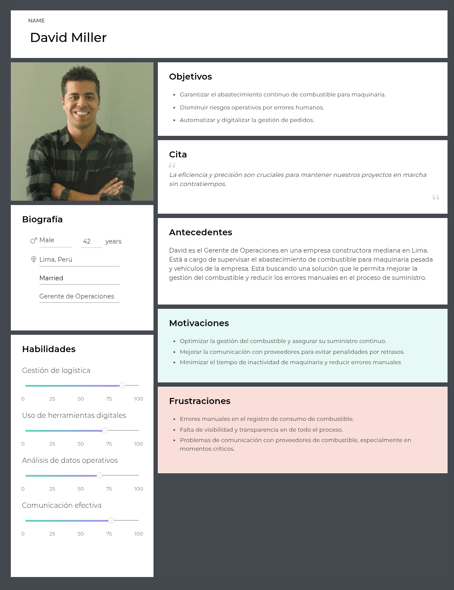

# Capítulo II: Requirements Elicitation & Analysis 
## 2.1. Competidores.

PetroApp es una plataforma digital que facilita la compra y venta de combustible, principalmente orientada a consumidores finales y estaciones de servicio. Permite ubicar estaciones cercanas, gestionar pagos electrónicos y controlar el consumo desde una app. Esta enfocada principalmente en el uso personal, pero también ofrece soluciones para empresas, con funcionalidades que permiten cierta trazabilidad y control, aunque con menos enfoque en el flujo completo del pedido corporativo.

FuelCloud es una solución tecnológica centrada en el control del despacho de combustible mediante una combinación de hardware y software. Este ofrece monitoreo en tiempo real, control de acceso al combustible, reportes detallados de consumo y ubicación, lo que la hace ideal para empresas con tanques propios. Además, se enfoca más en el control físico del combustible que en la gestión administrativa o logística del pedido entre proveedor y cliente.

Wialon es una plataforma global de gestión de flotas que incluye funcionalidades para el control de combustible, seguimiento de vehículos por GPS, y análisis de consumo. Ofrece herramientas de visualización en tiempo real, alertas automatizadas y reportes avanzados. Si bien no gestiona directamente el flujo de pedidos entre proveedores y solicitantes, es altamente utilizada por empresas distribuidoras y logísticas que transportan combustible, lo que la convierte en un competidor indirecto pero funcionalmente cercano a FuelTrack.

### 2.1.1. Análisis competitivo.

| Competitive Analysis Landscape | 
--------------------------------------------|
| **¿Por qué llevar a cabo este análisis?** |
|Este análisis se está llevando a cabo porque queremos conocer las ventajas y desventajas de nuestra aplicación frente a la competencia, y cómo nos diferenciamos de ellas.

| **Categoría** | **FuelTrack** | **Zavgar** |  **FuelCloud** | **Wialon** |
| ------------- |----------------- |------------------|------------------|------------------------|
| **Overview** | Plataforma web que digitaliza y estructura el proceso completo de pedido de combustible entre empresas y proveedores. | SaaS para la gestión de consumo de combustible de flotas, con enfoque en eficiencia, monitoreo y costos. | Solución con hardware/software para el control físico del despacho de combustible.| Plataforma de gestión de flotas con control de combustible, GPS y reportes operativos. |
| **Ventaja competitiva** | Especialización en el flujo completo de pedido, despacho y análisis; integración de pagos y logística; UI intuitiva. | No requiere hardware; ofrece métricas, control de gastos y reportes sobre consumo. | Control físico preciso del combustible, monitoreo en tiempo real. | Seguimiento en tiempo real, visualización de rutas, integración con sensores de combustible. |
| **¿Qué valor ofrece al cliente?** | Trazabilidad total, eficiencia operativa, reportes de consumo y validación segura de pedidos. | Optimización de costos y control sobre el uso de combustible en flotas. | Seguridad y precisión operativa en el control de combustible. | Trazabilidad de flotas, alertas automáticas, análisis de rutas y consumo de combustible. |
| **Mercado objetivo** | Empresas que solicitan combustible a proveedores. | Empresas con flotas vehiculares que desean monitorear y reducir el consumo de combustible. | Empresas con tanques de combustible propios. | Empresas logísticas, distribuidoras y de transporte de combustible. |
| **Estrategias de marketing**| Alianzas con proveedores, demostraciones de ahorro, marketing de contenido enfocado en eficiencia. | Enfoque digital, contenido técnico, integración con proveedores de tarjetas de combustible. | Ferias industriales, distribuidores, venta consultiva entre empresas. | Alianzas con distribuidores de GPS, marketing técnico, ferias de transporte. |
| **Productos & Servicios** | Plataforma para gestión completa de pedidos, seguimiento, reportes, validación y alertas. | Plataforma web con módulo de abastecimiento, reportes de consumo, integración GPS y tarjetas. | Hardware IoT y software para gestión, y control de combustible. | Plataforma SaaS + app móvil con monitoreo, alertas, mapas y módulos personalizables. |
| **Precios & Costos** | Modelo SaaS con suscripción escalable según volumen y servicios. | SaaS con modelos por flota activa o vehículos monitoreados. | Venta e instalación de hardware + licencias de software. | Modelo SaaS modular, basado en vehículos activos y funcionalidades activadas. |
| **Canales de distribución** | Web app responsive, potencial app móvil futura. | Web app, marketing digital y comunidad de flotas. | Plataforma web + hardware instalado en sitio. | Red de partners global, distribuidores locales e integradores de sistemas GPS. |
| **Fortalezas** | Enfoque especializado, experiencia de usuario optimizada, integraciones clave, análisis avanzado de consumo. | Implementación ágil, sin hardware, fácil adopción en empresas medianas. | Control físico riguroso, solución probada en industrias exigentes.| Plataforma robusta, cobertura internacional, integración con más de 2,400 dispositivos GPS. |
| **Debilidades** | Nueva en el mercado, menor reconocimiento de marca, necesita consolidar confianza. | No gestiona el flujo completo del pedido, enfoque parcial en flotas. | Alto costo, dependencia de hardware, menor adaptabilidad en mercados emergentes. | No gestiona pedidos entre proveedor y solicitante, requiere configuración técnica inicial. |
| **Oportunidades** | Alta informalidad en el sector, digitalización creciente en logística, necesidad de trazabilidad y control. | Mayor conciencia en eficiencia de flotas y digitalización de costos operativos. | Nuevos mercados industriales con enfoque en seguridad y control. | Creciente necesidad de control logístico y monitoreo de distribución en países en desarrollo. |
| **Amenazas**  | Aparición de soluciones similares, resistencia al cambio en empresas tradicionales, competencia ERP. | SaaS especializados con mayor cobertura funcional (ERP, proveedores, logística). | SaaS ágiles y sin hardware físico, que ofrecen soluciones más accesibles. | SaaS más específicos y ligeros, enfocados exclusivamente en la trazabilidad de entregas. |

### 2.1.2. Estrategias y tácticas frente a competidores.

#### a. Diferenciación a través de especialización
Una de las principales estrategias de **FuelTrack** es la **especialización en el flujo completo de pedido de combustible**. A diferencia de soluciones como **Zavgar**, que están orientadas principalmente al control y análisis del consumo de combustible en flotas, nuestra plataforma se enfoca en las **interacciones B2B** entre empresas solicitantes y proveedores. Esto nos permite ofrecer un **control dedicado del pedido**, **gestión de la logística**, y **reportes detallados de consumo y entregas**, lo cual no está presente en la mayoría de las plataformas competidoras.

- **Táctica**: Desarrollar funcionalidades para la **validación automática de pagos**, **gestión de stock en tiempo real** y la **optimización del transporte** logrando la automatización de procesos que solo eran logrados de forma manual. Esto crea una ventaja frente a competidores como **FuelCloud**, que se centran más en el control físico del combustible y menos en la administración a nivel operativo.

#### b. Innovación en la interfaz de usuario y experiencia

El sistema de **FuelTrack** está diseñado para ofrecer una **experiencia de usuario optimizada**, algo que **Wialon**, **FuelCloud** y la propia **OSINERGMIN** no abordan en sus plataformas. Al ser una solución especializada y dirigida a una tarea específica, podemos dedicar más recursos en crear una interfaz intuitiva y procesos bien definidos brindando comodidad y seguridad a nuestros usuarios.

- **Táctica**: Diseñar una **interfaz intuitiva y consistente** que permita a los usuarios acceder a reportes de consumo, validar pedidos y coordinar logística con facilidad. Además, ofrecer **soporte y formación continua** para asegurar que los usuarios aprovechen al máximo todas las funcionalidades del sistema.

#### c. Flexibilidad en precios y modelo SaaS escalable
El modelo de precios de **FuelTrack** ofrece **planes escalables basados en suscripción**, lo que hace que sea más accesible para medianas y grandes empresas. Esto es más competitivo frente a **Wialon**, que puede no ser una opción viable para empresas que solo requieren una solución de pedidos de combustible. También es más asequible que **FuelCloud**, que requiere una inversión considerable en hardware, instalación y mantenimiento.

- **Táctica**: Ofrecer un modelo de suscripción flexible y **precios competitivos**, con **múltiples niveles de suscripción** adaptados a las necesidades de diferentes empresas. Esto permitirá que empresas de menor tamaño puedan acceder a la plataforma sin comprometer su presupuesto, a la vez que se asegura el crecimiento a largo plazo a medida que la empresa crece.

#### d. Aprovechamiento de la digitalización en la logística
El sector de la logística está experimentando una transformación digital acelerada. **FuelTrack** se aprovechará de esta tendencia buscando la integración de la plataforma con otras soluciones logísticas (como los sistemas de gestión de vehículos o flotas). De esta forma podemos ofrecer una solución más completa y eficiente.

- **Táctica**: Colaborar con empresas de **gestión de flotas** para optimizar el proceso de asignación de vehículos, cisternas y choferes. También se considerará la posibilidad de integrar **sensores IoT** en los camiones de reparto para un control más preciso sobre el combustible transportado y la entrega.

#### e. Expansión hacia mercados internacionales
Si bien **FuelTrack** está inicialmente orientada a empresas locales, el modelo de negocio y la flexibilidad de la plataforma la hacen ideal para expandirse a **mercados internacionales**. Competidores como **Wialon** ya tienen presencia en mercados globales, pero su enfoque en empresas grandes y sus altos costos de implementación pueden ser una barrera para empresas de menor tamaño, limitando su alcance.

- **Táctica**: Iniciar la expansión en mercados emergentes donde la digitalización en la logística es una necesidad creciente. Esto incluirá la **localización de la plataforma** (idioma, moneda, regulaciones locales) para facilitar la adaptabilidad de los nuevos mercados.

## 2.2. Entrevistas.
### 2.2.1. Diseño de entrevistas.

Para comprender mejor a nuestros segmentos objetivo, se han definido dos entrevistas diferenciadas según el segmento objetivo: 
- Proveedores de combustible
- Empresas con contratos de suministro (clientes corporativos)

---
#### A. Proveedores de Combustible

**Preguntas:**

1. ¿Cómo gestionan actualmente los pedidos de empresas clientes?
2. ¿Usan algún sistema digital para registrar pedidos o es manual?
3. ¿Qué pasos se siguen desde que un cliente hace un pedido hasta que se entregue?
4. ¿Cómo controlan que lo despachado coincida con lo solicitado?
5. ¿Qué tipo de reportes requieren generar (volúmenes, facturación, entregas, etc.)?
6. ¿Tienen un sistema para validar el stock antes de preparar el despacho de un pedido?
7. ¿Cómo hacen el seguimiento de los pedidos? ¿Informan al cliente en tiempo real?
8. ¿Qué problemas suelen ocurrir en el proceso de atención de pedidos empresariales?
9. ¿Cómo se realiza la conciliación de pagos con los clientes?
10. ¿Estarían dispuestos a integrar su sistema actual con una plataforma SaaS que unifique y centralice estos procesos?

**Preguntas complementarias:**

- ¿Qué edad tiene?
- ¿Cuál es su nivel de experiencia en logística o ventas?
- ¿Qué tipo de dispositivo usa en el trabajo? (PC, tablet, celular)
- ¿Qué aplicaciones o herramientas digitales usa en su día a día?
- ¿Cómo describiría su nivel de habilidad con la tecnología?
---

#### B. Empresas Solicitantes

**Preguntas:**

1. ¿Cómo solicitan actualmente combustible a su proveedor?
2. ¿Utilizan un sistema propio o envían pedidos por correo, WhatsApp, etc.?
3. ¿Cómo verifican que lo entregado coincida con lo solicitado?
4. ¿Tienen problemas con entregas incompletas o fuera de tiempo?
5. ¿Con qué frecuencia necesitan reportes de consumo, entregas o pagos?
6. ¿Qué tan importante es para ustedes tener trazabilidad de cada entrega?
7. ¿Quiénes son los responsables de validar pedidos y autorizar pagos?
8. ¿Cómo gestionan las reprogramaciones o cancelaciones de pedidos?
9. ¿Qué herramientas utilizan para monitorear el consumo mensual?
10. ¿Qué mejoras desearían ver en el proceso actual?

**Preguntas complementarias:**

- ¿Qué edad tiene?
- ¿En qué distrito vive y trabaja?
- ¿Qué nivel de estudios tiene?
- ¿Qué dispositivos utiliza más frecuentemente en el trabajo?
- ¿Qué aplicaciones o plataformas usa para su gestión operativa?
- ¿Cuáles son sus principales frustraciones en el proceso actual?

---

### 2.2.2. Registro de entrevistas.
### 2.2.3. Análisis de entrevistas.
## 2.3. Needfinding.
### 2.3.1. User Personas.

a. User Persona 1: Empresas solicitantes de combustible

b. User Persona 2: Proveedores de combustible

### 2.3.2. User Task Matrix.

| **Tarea**                                      | **David Miller – Frecuencia** | **David Miller – Importancia** | **Ana Pérez – Frecuencia** | **Ana Pérez – Importancia** |
|------------------------------------------------|-------------------------------|---------------------------------|-----------------------------|------------------------------|
| Revisar nivel de stock de combustible          | Alta | Alta | Baja | Baja |
| Realizar pedido de combustible                 | Media | Alta | Alta | Alta |
| Validar confirmación de pedido                 | Alta | Alta | Alta | Alta |
| Hacer seguimiento a la entrega                 | Alta | Alta | Alta | Alta |
| Supervisar descarga y recepción                | Media | Alta | Media | Media |
| Evaluar proceso post-servicio                  | Baja | Media | Alta | Alta |
| Gestionar atención al cliente                  | Media | Alta | Alta | Alta |
| Revisar encuestas o feedback                   | Baja | Media | Media | Alta |

### 2.3.3. User Journey Mapping.

### 2.3.4. Empathy Mapping. 

### 2.3.5. As-is Scenario Mapping. 
### As-Is Scenario Mapping

| FASES             | Comunicación                                 | Solicitar pedido                                 | Seguimiento                                     | Entrega                                      |
|-------------------|----------------------------------------------|--------------------------------------------------|------------------------------------------------|---------------------------------------------|
| **DOING**         | Llamadas, correos, WhatsApp sin orden.       | El solicitante explica los datos del pedido a mano. | Se hacen llamadas para preguntar por el estado. | Se confirma por llamada o mensaje.           |
| **THINKING**      | "¿Habrán recibido mi mensaje?"               | "¿Me habrán entendido bien?"                     | "¿Dónde estará nuestro pedido?"                | "¿Ya habrán llegado?"                        |
| **FEELING**       | Frustración, desorganización.                | Incertidumbre, falta de confianza.               | Ansiedad, impaciencia.                         | Duda, estrés.                                |

## 2.4. Ubiquitous Language. 
