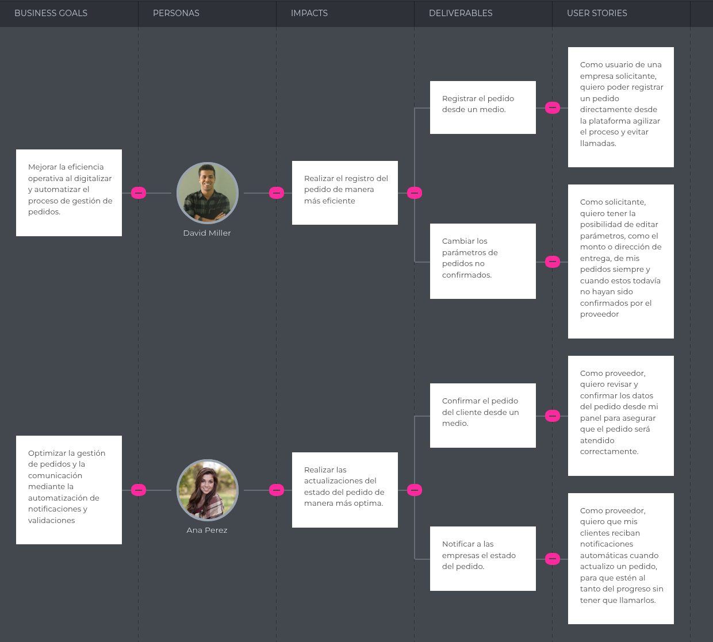

# Capitulo III: Requirements Specifications
<h3>3.1 To-Be Scenario Mapping</h3>

<table border="1" cellspacing="0" cellpadding="6">
  <thead>
    <tr>
      <th>FASES</th>
      <th>Comunicación</th>
      <th>Solicitar pedido</th>
      <th>Seguimiento</th>
      <th>Entrega</th>
    </tr>
  </thead>
  <tbody>
    <tr>
      <td><strong>DOING</strong></td>
      <td>Utiliza la plataforma centralizada FuelTracks, con historial de comunicación y notificaciones automáticas.</td>
      <td>Completa un formulario estructurado directamente desde la web o app.</td>
      <td>Revisa el panel de seguimiento con estado del pedido en tiempo real.</td>
      <td>Recibe una confirmación automática con hora estimada y firma digital.</td>
    </tr>
    <tr>
      <td><strong>THINKING</strong></td>
      <td>"Puedo revisar todos mis pedidos desde un solo lugar."</td>
      <td>"Todo quedó registrado sin ningún error."</td>
      <td>"Puedo ver exactamente en qué etapa está mi pedido y cuánto falta para que pueda recibirlo."</td>
      <td>"Recibí el pedido tal como estaba programado."</td>
    </tr>
    <tr>
      <td><strong>FEELING</strong></td>
      <td>Tranquilidad, control.</td>
      <td>Confianza, seguridad.</td>
      <td>Calma, claridad.</td>
      <td>Satisfacción, alivio.</td>
    </tr>
  </tbody>
</table>

---

<h3>3.2 User Stories</h3>

<table border="1" cellspacing="0" cellpadding="6">
  <thead>
    <tr>
      <th>Epic/User Story ID</th>
      <th>Título</th>
      <th>Descripción</th>
      <th>Criterios de aceptación</th>
      <th>Relacionado con (Epic ID)</th>
    </tr>
  </thead>
  <tbody>
    <tr>
      <td>EP01</td>
      <td>Gestión de pedidos de combustible de solicitante</td>
      <td>Como usuario solicitante de combustible, quiero poder registrar mis pedidos fácilmente y con la capacidad de establecer parámetros específicos para evitar errores en la comunicación y recibir lo que necesito.</td>
      <td><strong>Escenario 1</strong>: Registro de pedido exitoso. En la plataforma, debería ver una sección en la plataforma para realizar nuevos pedidos, donde encuentre un formulario en el que pueda especificar lo que necesito y posteriormente registrar la orden.   <strong>Escenario 2</strong>: Visualización de historial de pedidos. Debería ser capaz de visualizar una sección que muestre todos mis pedidos anteriores.   <strong>Escenario 3</strong>: Edición antes de la confirmación. Antes de que los pedidos sean confirmados por los proovedores, debería tener la posibilidad de hacer ediciones a este o incluso poder cancelarlo.</td>
      <td>-</td>
    </tr>
    <tr>
      <td>US01</td>
      <td>Crear nuevo pedido</td>
      <td>Como usuario de una empresa solicitante, quiero poder registrar un pedido directamente desde la plataforma agilizar el proceso y evitar llamadas.</td>
      <td>Dado que el usuario ingrese todos los campos requeridos, Cuando envíe el pedido, Entonces el sistema deberá procesarlo, asignar un ID único y enviarlo a los proovedores para que confirmen la orden.</td>
      <td>EP01</td>
    </tr>
    <tr>
      <td>US02</td>
      <td>Consultar historial de pedidos</td>
      <td>Como solicitante, quiero poder consultar mi historial de pedidos anteriores, y poder ver cada uno con información detallada. Además, debo ser capaz de filtrar y ordenar el historial según características específicas de los pedidos.</td>
      <td>Dado que el usuario acceda a la sección de seguimiento,Cuando seleccione un pedido,Entonces podrá ver si fue recibido, confirmado, en ruta o entregado.</td>
      <td>EP01</td>
    </tr>
    <tr>
      <td>US03</td>
      <td>Editar pedidos</td>
      <td>Como solicitante, quiero tener la posibilidad de editar parámetros, como el monto o dirección de entrega, de mis pedidos siempre y cuando estos todavía no hayan sido confirmados por el rpoovedor</td>
      <td>Dado que el usuario acceda a la sección de pedidos activo, Cuando seleccione un pedido que se encuentra sin confirmar ,Entonces podrá editar los parámetros del pedido.</td>
      <td>EP01</td>
    </tr>
    <tr>
      <td>EP02</td>
      <td>Gestión de pedidos recibidos por el proovedoor</td>
      <td>Como usuario proovedor de combustible, quiero poder revisar los pedidos realizados por mis clientes, actualizar el estado de cada uno y dar actualizaciones en tiempo real a mis clientes.</td>
      <td><strong>Escenario 1</strong>: Visualización de pedidos entrantes. Dado que haya pedidos activos, Cuando el proveedor acceda a su panel, Entonces debería poder ver una lista de pedidos con detalles clave (cliente, ubicación, volumen, estado).   <strong>Escenario 2</strong>: Actualización de estado del pedido.Dado que un pedido esté en curso,Cuando el proveedor actualice su estado (confirmado, en ruta, entregado),Entonces el sistema deberá reflejar el cambio en tiempo real.   <strong>Escenario 3</strong>: Notificación a los clientes. Dado que el proveedor realice un cambio o actualización a un pedido, Cuando el cliente esté en la plataforma, entonces deberá ver una notificación con información de los cambios ocurridos.</td>
      <td>-</td>
    </tr>
    <tr>
      <td>US04</td>
      <td>Confirmar pedido recibido</td>
      <td>Como proveedor, quiero revisar y confirmar los datos del pedido desde mi panel para asegurar que el pedido será atendido correctamente.</td>
      <td>Dado que el proveedor acceda al listado de pedidos,Cuando revise y confirme uno,Entonces se realizarán los cambios inmediatamente y se actualizará la plataforma.</td>
      <td>EP02</td>
    </tr>
    <tr>
      <td>US05</td>
      <td>Actualización de un pedido</td>
      <td>Como proveedor de combustible, quiero poder actualizar el estado e información de los pedidos en tiempo real, para mantener a mis clientes informados y organizar mejor mis entregas.</td>
      <td>Dado que existan pedidos activos para el proveedor, Cuando el proveedor los seleccione,Entonces el sistema deberá darle la posibilidad de hacerle cambios o darle actualizaciones.</td>
      <td>-</td>
    </tr>
    <tr>
      <td>US06</td>
      <td>Notificaciones a clientes sobre cambios</td>
      <td>Como proovedor, quiero que mis clientes reciban notificaciones automáticas cuando actualizo un pedido, para que estén al tanto del progreso sin tener que llamarlos.</td>
      <td>Dado que se modifique el estado o datos del pedido, Cuando se actualice a "confirmado", "en ruta" o "entregado", Entonces el sistema debe enviar una notificación push, correo o WhatsApp al cliente.</td>
      <td>EP02</td>
    </tr>
    <tr>
      <td>US07</td>
      <td>Cancelación o rechazo de pedidos</td>
      <td>Como proveedor de combustible, quiero poder rechazar o cancelar un pedido y enviar un mensaje al cliente explicando los motivos, para mantener una comunicación clara y evitar confusiones.</td>
      <td>Dado que el proveedor no pueda atender un pedido,Cuando seleccione la opción de cancelar o rechazar,Entonces el sistema deberá solicitarle ingresar un mensaje explicando el motivo y notificar al cliente con dicha información.</td>
      <td>EP02</td>
    </tr>
    <tr>
      <td>EP03</td>
      <td>Gestión de seguridad y acceso</td>
      <td>Como usuario de ambos segmentos de la plataforma, quiero que mis datos estén protegidos y acceder solo mediante autenticación segura, para garantizar la privacidad y evitar accesos no autorizados.</td>
      <td><strong>Escenario 1</strong>: Inicio de sesión seguro. Dado que el usuario tenga una cuenta, Cuando intente iniciar sesión con correo y contraseña, Entonces el sistema debe validar las credenciales y otorgar acceso solo si son correctas, evitando revelar información en caso de error.   <strong>Escenario 2</strong>: Control de accesos según rol. Dado que un usuario (cliente o proveedor) haya iniciado sesión,Cuando intente acceder a secciones específicas de la plataforma, Entonces solo deberá poder ver y operar dentro de las funcionalidades permitidas por su tipo de cuenta.   <strong>Escenario 3</strong>: Autenticación multifactor para operaciones. Dado que un cliente esté realizando un pedido,Cuando intente enviarlo o confirmarlo,Entonces el sistema deberá activar un segundo paso de verificación (código temporal o notificación) antes de procesar la acción..</td>
      <td>-</td>
    </tr>
    <tr>
      <td>US08</td>
      <td>Inicio de sesión</td>
      <td>Como usuario registrado, quiero iniciar sesión con mi correo y contraseña, para acceder a mi cuenta de forma segura.</td>
      <td>Dado que el usuario tenga una cuenta, Cuando intente iniciar sesión,Entonces el sistema deberá validar sus credenciales y permitir el acceso solo si son correctas.</td>
      <td>EP03</td>
    </tr>
    <tr>
      <td>US09</td>
      <td>Registro de cuenta nueva</td>
      <td>Como visitante, Quiero crear una cuenta con correo, contraseña y rol (cliente o proveedor), Para acceder y comenzar a utilizar la plataforma.</td>
      <td>Dado que el usuario complete todos los campos requeridos, Cuando presione “Crear cuenta”, Entonces la cuenta deberá crearse correctamente y redirigirlo a su panel.</td>
      <td>EP03</td>
    </tr>
    <tr>
      <td>US10</td>
      <td>Recuperación de contraseña</td>
      <td>Como usuario, Quiero tener la posibilidad de recuperar mi contraseña mediante correo electrónico, Para no perder el acceso a mi cuenta en caso la olvide.</td>
      <td>Dado que el usuario no recuerde su contraseña, Cuando seleccione “¿Olvidaste tu contraseña?”,Entonces deberá recibir un correo con un enlace para restablecerla.</td>
      <td>EP03</td>
    </tr>
    <tr>
      <td>US11</td>
      <td>Acceso restringido por roles</td>
      <td>Como administrador de la plataforma, Quiero que los usuarios solo accedan a las secciones según su tipo de cuenta, Para evitar errores en el sistema</td>
      <td>Dado que un usuario acceda a la plataforma, Cuando vea las secciones que tiene disponible, Entonces verá únicamente las que son correspondientes a su rol.</td>
      <td>EP03</td>
    </tr>
    <tr>
      <td>US12</td>
      <td>Autenticación MFA para realizar pedidos</td>
      <td>Como empresa solicitante, Quiero que se me solicite una autenticación multifactor al momento de realizar un pedido, Para asegurar que solo personal autorizado pueda emitir órdenes de compra</td>
      <td>Dado que el cliente quiera registrar un pedido, Cuando complete los datos del formulario de registro, Entonces deberá recibir un código de autenticación y solo podrá finalizar el pedido tras ingresarlo correctamente.</td>
      <td>EP03</td>
    </tr>
    <tr>
      <td>EP04</td>
      <td>Landing Page informativa y funcional</td>
      <td>Como parte de la solución, quiero ofrecer una landing page que muestre los beneficios y funcionalidades de FuelTrack, para captar el interés de potenciales usuarios.</td>
      <td><strong>Escenario 1</strong>: Visualización pública. Cuando alguien acceda al dominio principal sin estar autenticado, el sistema debe mostrar la landing page con secciones informativas, beneficios del sistema, segmentos objetivo y llamadas a la acción hacia login/registro.   <strong>Escenario 2</strong>: Redirección según interés. Al hacer clic en 'Quiero registrarme', debe llevar al formulario correspondiente según el segmento.</td>
      <td>-</td>
    </tr>
    <tr>
      <td>US13</td>
      <td>Visualización del landing page</td>
      <td>Como usuario de la plataforma, quiero que el sistema muestre un landing page informativo para que los interesados conozcan los beneficios antes de registrarse.</td>
      <td>Dado que alguien acceda a la URL principal, Cuando no esté autenticado, Entonces deberá visualizar el landing page con secciones informativas y botones hacia login o registro.</td>
      <td>EP04</td>
    </tr>
    <tr>
      <td>TS01</td>
      <td>Implementar endpoint REST para pedidos</td>
      <td>Como desarrollador, quiero implementar un endpoint RESTful para registrar pedidos, para que la aplicación frontend pueda enviar solicitudes válidas al backend.</td>
      <td>Dado que se realice una solicitud POST con datos válidos, Cuando se procese en el backend, Entonces deberá guardarse el pedido en la base de datos y devolver un código 201 con ID.</td>
      <td>EP01</td>
    </tr>
    <tr>
      <td>TS02</td>
      <td>Servicio de autenticación y token</td>
      <td>Como desarrollador, quiero implementar un servicio de autenticación con generación de tokens, para proteger las rutas privadas de la plataforma.</td>
      <td>Dado que un usuario inicie sesión, Cuando las credenciales sean válidas, Entonces el sistema deberá generar un token JWT para acceso a recursos protegidos.</td>
      <td>EP03</td>
    </tr>
    <tr>
      <td>TS03</td>
      <td>Envío de notificaciones por cambios de estado</td>
      <td>Como desarrollador, quiero implementar un servicio que envíe notificaciones automáticas cuando un pedido cambie de estado, para mantener informados a los usuarios.</td>
      <td>Dado que el estado de un pedido sea actualizado, Cuando se complete la acción, Entonces deberá enviarse una notificación por correo o WhatsApp al usuario correspondiente.</td>
      <td>EP02</td>
    </tr>
    <tr>
      <td>TS04</td>
      <td>Registro y validación de ubicación GPS</td>
      <td>Como desarrollador, quiero permitir que los pedidos en ruta envíen coordenadas GPS, para poder visualizar la trazabilidad del transporte en tiempo real.</td>
      <td>Dado que un conductor envíe su ubicación, Cuando el backend reciba las coordenadas, Entonces deberán almacenarse y estar disponibles para visualización en el frontend.</td>
      <td>EP02</td>
    </tr>
  </tbody>
</table>

## 3.3 Impact Mapping

<h3>3.4 Product Backlog</h3>

<table border="1" cellspacing="0" cellpadding="6">
  <thead>
    <tr>
      <th>#Orden</th>
      <th>ID</th>
      <th>User Story</th>
      <th>Story Points</th>
    </tr>
  </thead>
  <tbody>
    <tr><td>01</td><td>US-01</td><td>Crear nuevo pedido</td><td>5</td></tr>
    <tr><td>02</td><td>US-02</td><td>Consultar historial de pedidos</td><td>3</td></tr>
    <tr><td>03</td><td>US-03</td><td>Editar pedidos</td><td>5</td></tr>
    <tr><td>04</td><td>US-04</td><td>Confirmar pedido recibido</td><td>3</td></tr>
    <tr><td>05</td><td>US-05</td><td>Actualización de un pedido</td><td>5</td></tr>
    <tr><td>06</td><td>US-06</td><td>Notificaciones a clientes sobre cambios</td><td>5</td></tr>
    <tr><td>07</td><td>US-07</td><td>Cancelación o rechazo de pedidos</td><td>3</td></tr>
    <tr><td>08</td><td>US-08</td><td>Inicio de sesión</td><td>3</td></tr>
    <tr><td>09</td><td>US-09</td><td>Registro de cuenta nueva</td><td>3</td></tr>
    <tr><td>10</td><td>US-10</td><td>Recuperación de contraseña</td><td>3</td></tr>
    <tr><td>11</td><td>US-11</td><td>Acceso restringido por roles</td><td>2</td></tr>
    <tr><td>12</td><td>US-12</td><td>Autenticación MFA para realizar pedidos</td><td>5</td></tr>
    <tr><td>13</td><td>US-13</td><td>Visualización del landing page</td><td>2</td></tr>
    <tr><td>14</td><td>TS-01</td><td>Implementar endpoint REST para pedidos</td><td>5</td></tr>
    <tr><td>15</td><td>TS-02</td><td>Servicio de autenticación y token</td><td>5</td></tr>
    <tr><td>16</td><td>TS-03</td><td>Envío de notificaciones por cambios de estado</td><td>3</td></tr>
    <tr><td>17</td><td>TS-04</td><td>Registro y validación de ubicación GPS</td><td>5</td></tr>
  </tbody>
</table>
