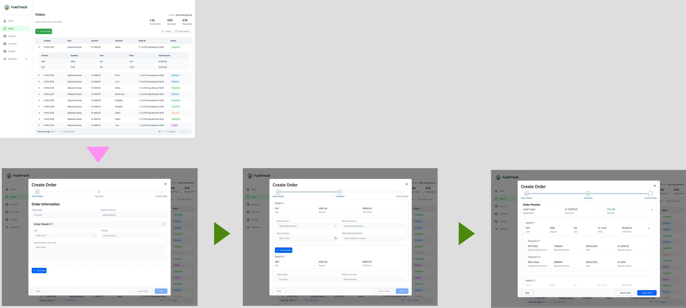

# Capítulo IV: Product Design
En la realización de este capitulo, abordaremos el diseño integral de la startup, cubriendo aspectos clave como el estilo visual, los diagramas C4 para la arquitectura del sistema, los diagramas de clases, y los modelos de base de datos, proporcionando una visión clara y estructurada de la infraestructura y el funcionamiento del proyecto.

## 4.1. Style Guidelines
En esta sección se presentan los estándares que definen el formato y el diseño de la solución, asegurando la calidad en su implementación.

### 4.1.1. General Style Guidelines
Con estas decisiones en el diseño visual buscamos reflejar innovación que incentive a la formalidad en los procesos de comercialización, es asi como demostramos modernidad y calidad, valores que van alineados a nuestro proyecto

**Color**

Seleccionamos esta gama de colores porque armoniza con el diseño del logo y refleja la temática de nuestra aplicación, asegurando la identidad de la marca.

**Tipografia**

Seleccionamos esta tipografía por su excelente legibilidad en diversos entornos, lo que nos permite diferenciarnos frente a la competencia y aportar una identidad única a nuestra marca.

**Branding**

El nombre de nuestro producto es FuelTrack, contamos con un logo que representa claramente nuestro rubro, dandole un toque moderno y simple, ademas usar colores que seran caractristicos en nuestra empresa y amigables a la vista de nuestros clientes

### 4.1.2. Web Style Guidelines
Nuestra página web ha sido diseñada para brindar una navegación cómoda y accesible desde cualquier dispositivo. Para lograrlo, utilizamos un diseño basado en el patrón en Z, el cual dirige de forma natural la atención del usuario hacia los elementos más importantes de la interfaz, facilitando la comprensión rápida de la información clave.
## 4.2. Information Architecture
La arquitectura de información se diseñó para guiar al usuario de forma lógica a través de las funciones esenciales de FuelTrack, facilitando la navegación y reduciendo la curva de aprendizaje.

### 4.2.1. Organization Systems
El Sistema de Organización de FuelTrack tiene como objetivo facilitar la interacción fluida entre los usuarios (compradores y proveedores) y la plataforma mediante una **jerarquía visual clara**. Esta jerarquía destaca las funciones clave —como la **gestión de pedidos de combustible**, el **registro de depósitos** y la **carga de documentos**— permitiendo que los usuarios accedan rápidamente a las acciones más importantes desde la pantalla principal.

- **Agrupación lógica de funciones**: Las funcionalidades están organizadas por bloques temáticos (“Record Deposits”, “Upload Documents”, “Track Orders”), lo que permite a los usuarios identificar rápidamente las opciones disponibles y su propósito.
  
- **Accesibilidad inmediata**: La interfaz principal resalta las opciones más utilizadas mediante una disposición vertical y centrada, optimizada tanto para escritorio como para dispositivos móviles.
  
- **Menú de navegación**: Se mantiene fijo en la parte superior para facilitar el acceso constante a secciones clave como "How it Works", "Pricing" y "Sign Up".
  
- **Reducción de fricción**: Al minimizar la cantidad de clics necesarios para ejecutar acciones comunes, el sistema organiza la información de forma que prioriza la eficiencia y la experiencia del usuario.

Este sistema organizativo asegura que tanto usuarios nuevos como recurrentes puedan navegar por FuelTrack con facilidad, incrementando la productividad y reduciendo los errores de operación.

### 4.2.2. Labeling Systems

Las etiquetas que utilizaremos para la página serán diseñadas para ser claras, directas y fáciles de entender, enfocándose en la eficiencia y simplicidad para usuarios con distintos niveles de experiencia tecnológica.

---

**Principios generales**

- Se limita el uso de **2-3 palabras** por ítem.
- Se mantiene la **consistencia terminológica** en todas las pantallas.
- Las etiquetas son descriptivas y responden a acciones directas, estados o categorías claras.

---

Algunas de las etiquetas principales de nuestras secciones serán las siguientes:

**Gestión de Pedidos**
- `Nuevo Pedido`
- `Estado de Pedido`
- `Historial de Pedidos`
- `Ver Detalles`
- `Confirmar Entrega`

**Pagos y Facturación**
- `Métodos de Pago`
- `Mis Facturas`
- `Resumen de Pagos`
- `Confirmar Pago`

**Reportes**
- `Reporte de Pedidos`
- `Reporte de Pagos`
- `Resumen de Actividad`
- `Generar Informe`

**Navegación general**
- `Inicio`
- `Mi Cuenta`
- `Soporte`
- `Cerrar Sesión`

---

**Asociaciones y agrupaciones**

- Las etiquetas se agrupan en **módulos lógicos** (por ejemplo: pedidos, pagos, reportes) con un menú lateral y dashboard central de fácil acceso.
- Las acciones están asociadas a sus contextos inmediatos: por ejemplo, `Nuevo Pedido` solo aparece cuando se selecciona la opción `Gestión de Pedidos`.
- Los mensajes del sistema son claros y directos: `Pedido Confirmado`, `Pago Realizado`, `Entrega Programada`.

---

Estas etiquetas están diseñadas para que los usuarios puedan navegar de manera sencilla y sin confusiones, optimizando la experiencia para empresas que desean una solución eficiente y fácil de usar.

### 4.2.3. SEO Tags and Meta Tag

Landing Page:
- Title (SEO Tag): FuelTrack | Simplify Fuel Order Management
- Description (Meta Tag): Optimize your fuel ordering process with FuelTrack — a centralized platform for buyers and suppliers to record deposits, upload documents, and track orders.
- Keywords (Meta Tag): Fuel, Track, Ordering, Fuel management, Supplier platform, Track fuel orders, Fuel deposits, Order management software
- Author (Meta Tag): FuelTrack Team

Web Application:
- Title (SEO Tag): FuelTrack | Manage Fuel Orders and Deposits
- Description (Meta Tag): Access your dashboard to record deposits, manage documents, and monitor fuel order status in real time.
- Keywords (Meta Tag): Fuel order tracking, Deposit management, Supplier dashboard, Fuel logistics, FuelTrack Web App
- Author (Meta Tag): FuelTrack Team

### 4.2.4. Searching Systems
Para garantizar una navegación fluida y centrada de nuestra plataforma, vamos a implementar las siguientes acciones y técnicas tanto para la pagina como la aplicación web:

- Menú de navegación: En la pagina, utilizaremos el Navigation Bar donde contiene enlaces visibles a las secciones más importantes de la plataforma, principalmente de sus caracteristicas y para el registro o ingreso de la cuenta. De esta forma, los nuevos usuarios se informarán rápidamente y a los usuarios existentes les permitirán acceder a sus cuentas fácilmente.
- Navegación Visual Guiada: El contenido está organizado en bloques visuales de las secciones determinadas en la barra principal, permitiendo al usuario desplazarse verticalmente para descubrir las funcionalidades de manera fluida.
- Responsive Design: Esta será construida para que se adapte al tipo de dispositivos del usuario. Por ejemplo, la resolución de la pagina estará optimizada según como sea redimensionada, tendrá compatibilidad tanto en dispositivos de escritorio como en portatiles. De esta forma, los usuarios realizarán sus tareas sin que el cambio de maquina sea un problema.

### 4.2.5. Navigation Systems
Para la plataforma, implementamos un sistema de búsqueda por texto y por categorias para que los usuarios, especialmente para los proveedores, puedan localizar los pedidos que sean realizado o se están llevando a cabo. Se incluirá filtros de la siguiente manera:

Busqueda por texto: El usuario tendrá una tabla de pedidos donde en cada categoria, razón social, numero de pedido, nombre de banco y demás, del pedido tendra un mini buscador estandár para buscar sus pedidos registrados o pendientes y entregará los resultados según el tipo de información que detecte automaticamente. Además, habrá un boton llamado "Busqueda avanzada" donde se realizará una busqueda más especifica siempre y cuando complete todas las categorias.

Busqueda por categoris: El usuario se le brindará un sistema automatico de filtro de datos de las categorias ya existentes para que pueda optimizar su tiempo en tareas de mayor importancia. Por ejemplo, el sistema se encargará de filtrar todas las ubicaciones detectadas de tus pedidos registrados o pendientes y se podrá seleccionar las que quieras aplicar.

## 4.3. Landing Page UI Design
La propuesta de diseño de la Landing Page para FuelTrack parte de una arquitectura de información clara y orientada a los segmentos objetivo definidos: empresas proveedoras de combustible y empresas solicitantes de combustible.

El diseño organiza el contenido en bloques visuales jerárquicos que guían al usuario de manera natural hacia los principales call-to-action (CTA), alineando cada sección con una necesidad identificada: informar, atraer y convertir.

Decisiones principales de diseño tomadas:

- **Navegación simple y consistente:** El menú principal permite acceso rápido a las secciones clave (Features, Pricing y Contact).
- **Call to Action diferenciados:** Hay botones específicos tanto para proveedores como para solicitantes, siguiendo un enfoque de segmentación clara.
- **Diseño inclusivo:** La paleta de colores cumple estándares de contraste para accesibilidad, y los botones tienen tamaños adecuados para pantallas táctiles.
- **Adaptabilidad:** El diseño es responsive, garantizando experiencia de usuario adecuada tanto en desktop como en dispositivos móviles.
- **Consistencia visual:** Se mantiene un diseño limpio y moderno, utilizando colores corporativos azul y verde para reforzar la identidad de FuelTrack.
### 4.3.1. Landing Page Wireframe

### 4.3.2. Landing Page Mock-up

## 4.4. Web Applications UX/UI Design
### 4.4.1. Web Applications Wireframes

**Wireframes - Segmento Cliente**
- Descripción: Vista diseñada exclusivamente para mostrar las ordenes de la empresa solicitante. Para ello optamos por una grilla que muestra fácilmente los atributos de cada orden.

---
- Descripción: Para mostrar losdetalles de cada pedido, optamos por una vista desplegable en cada fila de la grilla. De esta forma, el usuario podrá observar los detalles de cada uno, como el producto solicitado, la cantidad y el monto total.

---
- Descripción: Para la creación del pedido, decidimos usar un modal que se muestra al hacer clic en el botón "Crear nuevo pedido". En este modal, el usuario podrá crear sus pedidos paso a paso con un  stepper implementado. El primer paso es llenar los detalles del nuevo pedido como el producto, cantidad, etc.

---
- Descripción: Para el segundo paso, usamos una lista desplegable de detalles, donde en cada uno de ellos el usuario podrá asignar información de pagos a cada detalle del pedido, como el monto, la cuenta bancaria y el número de operación, todo mediante un pequeño formulario.

---
- Descripción: Para el paso final, mostramos toda la información del pedido, incluyendo sus detalles y la información de los pagos. El usuario podrá revisar todo antes de confirmar el pedido.

---

**Wireframes - Segmento Proveedor**
- Descripción: Esta vistafue diseñada para darle protagonismo a los pedidos y sus detalles meidante una grilla. Además, facilitamos la clasificación de los pedidos por estado a través de etiquetas ubicadas en la parte superior de la grilla que expone los pedidos.

---
- Descripción: En el segundo modulo de nuestro sistema, ubicamos una vistade conciliaciones que muestra una tabla con registros seleccionables. Aquí, la información principal es la de los pagos realizados a los pedidos. Para ello, el proveedor cuenta con un botón en la parte superior para subir una lista de movimientos de cuentas bancarias.

---
- Descripción: Diseñamos un modal muy sencillo que permite subir multiples archivos con movimientos de cuentas bancarias. Una vez subidos, el proveedor solo debe hacer click en el botón comparar y el sistema se encargará de hacer la conciliación con los pedidos realizados por los clientes.

---
- Descripción: Para el utlimo modulo principal, presentamos la vista de Despacho. Aqui podremos configurar la información de despacho a través de un botón de configuración en cada fila de la grilla, que representa un pedido. Una vez con información válida de despacho, el pedido será marcado con un check, dando a entender al usuario que el pedido está listo para ser liberado. Para ayudar al usuario, también facilitamos chekcboxes para seleccionar los pedidos que se desean liberar, si es que son varios.

---
- Descripción: Al hacer click en el botón de configuración, se abrirá un modal donde el proveedor podrá llenar la información de despacho del pedido. El proveedor podrá seleccionar el vehiculo, el chofer y la cisterna que se utilizará para el despacho del pedido.

---
- Descripción: La tabla para asignar compartimientos a los detalles del pedido se desbloquea unavez que la información del transporte es validada. En esta tabla, el proveedor podrá asignar los compartimientos de la cisterna a cada detalle del pedido.

---

### 4.4.2. Web Applications Wireflow Diagrams

**Wire Flow Diagram - Segmento Cliente**
- User Goal: Estructuramos el diseño de esta vista para el cliente del tal forma que visualice de forma clara y sencilla el estado de sus pedidos, así como la opción de crear un nuevo pedido. El cliente podrá ver el detalle de cada pedido, así como los detalles de pago asociados a cada uno. Finalmente, el cliente podrá registrar un nuevo pedido, asignando los detalles del pedido y la información de pago asociada a cada detalle.

**Wire Flow Diagram - Segmento Provedor**
- User Goal: Las vista del proveedor están diseñadas para que el usuario pueda gestionar los pedidos de combustible. Para ello, el proveedor podrá ver el estado de cada pedido y observar los detalles de cada uno. Es posible filtrar por estado de pedido, cliente o fecha. En el resto de módulo, el proveedor podrá conciliar la información de los pagos y, si todo es correcto, liberar el pedido para su despacho. El proveedor deberá llenar la información de despacho y asignar los compartimientos de la cisterna a cada detalle del pedido.

### 4.4.3. Web Applications Mock-ups
**Wireframes - Segmento Cliente**

- Objetivo: Vista general de las ordenes de la empresa solicitante, donde se puede ver el estado de cada pedido y la opción de crear un nuevo pedido.
---

- Objetivo: Desplegamos cada pedido para observar los detalles de cada uno, como el producto solicitado, la cantidad y el monto total.
---

- Objetivo: Mostramos el modal para registrar un nuevo pedido, donde el usuario puede especificar los detalles del nuevo pedido como el producto, cantidad, etc.
---

- Objetivo: En el segundo paso del registro de un nuevo pedido, el usuario puede asignar información de pagos a cada detalle del pedido, como el monto, la cuenta bancaria y el número de operación.
---

- Objetivo: Finalmente mostraremos la vista previa de todo el pedido, donde el usuario puede revisar todos los detalles antes de confirmar el pedido.

---
**Wireframes - Segmento Proveedor**

- Objetivo: Vista general de las ordenes de los clientes del proveedor, donde se puede ver el estado de cada pedido y observar los detalles de cada uno. Es posible filtrar por estado de pedido, cliente o fecha.
---

- Objetivo: Mostramos una vista para conciliaciones. Es decir, podremos subir una lista de movimientos de cuentas bancarias y el sistema se encargará de hacer la conciliación con los pedidos realizados por los clientes.
---

- Objetivo: Mostramos el modal para subir los archivos de los movimientos. Una vez hechas las conciliaciones, el sistema pasará el pedido a la siguiente fase: Aprobación.
---

- Objetivo: Vista de despacho. En esta vista los pedidos deberán ser liberados. Para ello, el proveedor deberá seleccionar pedidos que tengan información de despacho válida, como placa de vehículo, cisterna, y chofer
---

- Objetivo: Mostramos el modal para llenar la información de despacho del pedido. El proveedor podrá seleccionar el vehiculo, el chofer y la cisterna que se utilizará para el despacho del pedido. Para su confirmación, el sistema deberpa validar esta información evaluando su disponibilidad. Hasta no llenarse, no podremos asignar compartimientos a los detalles del pedido.
---

- Objetivo: Con la información del transporte validada, podremos asignar los compartimientos de la cisterna a cada detalle del pedido.
---
### 4.4.4. Web Applications User Flow Diagrams
**User Flow Diagram - Segmento Cliente**
- User Goal: El usuario desea registrar un nuevo pedido de combustible. Para ello, el usuario deberá llenar la información del pedido y los detalles de pago

**User Flow Diagram - Segmento Provedor**
- User Goal: El proveedor debe gestionar los pedidos de combustible. Para ello, debe conciliar la información de los pagos y, si todo es correcto, liberar el pedido para su despacho. El proveedor deberá llenar la información de despacho y asignar los compartimientos de la cisterna a cada detalle del pedido.

## 4.5. Web Applications Prototyping
#### Desktop Web Application ####

Link: https://upcedupe-my.sharepoint.com/:v:/g/personal/u202310129_upc_edu_pe/Edy1alDH_alNlZjFMNxoDc8BBoMO6nXS4bQS2VoDvZNCXw?e=koelSR&nav=eyJyZWZlcnJhbEluZm8iOnsicmVmZXJyYWxBcHAiOiJTdHJlYW1XZWJBcHAiLCJyZWZlcnJhbFZpZXciOiJTaGFyZURpYWxvZy1MaW5rIiwicmVmZXJyYWxBcHBQbGF0Zm9ybSI6IldlYiIsInJlZmVycmFsTW9kZSI6InZpZXcifX0%3D

#### Mobile Web Application ####

Link: https://upcedupe-my.sharepoint.com/:v:/g/personal/u202310129_upc_edu_pe/ERIXuDHFrCZFr14xw48-U18BI1lKdcBvtNsYy7u5GATkqw?e=Qw4caQ&nav=eyJyZWZlcnJhbEluZm8iOnsicmVmZXJyYWxBcHAiOiJTdHJlYW1XZWJBcHAiLCJyZWZlcnJhbFZpZXciOiJTaGFyZURpYWxvZy1MaW5rIiwicmVmZXJyYWxBcHBQbGF0Zm9ybSI6IldlYiIsInJlZmVycmFsTW9kZSI6InZpZXcifX0%3D

## 4.6. Domain-Driven Software Architecture
Esta sección expone la arquitectura de software orientada al dominio, una metodología que enfoca el diseño y desarrollo del sistema en el conocimiento profundo del entorno de negocio. Este enfoque busca lograr una mayor coherencia entre el software y los procesos empresariales, promoviendo una comunicación más efectiva entre los desarrolladores y los especialistas del dominio. Seguidamente, se describen los distintos diagramas y contextos delimitados que estructuran la arquitectura del proyecto.

### 4.6.1. Software Architecture Context Diagram
El diagrama de contexto del sistema muestra la relación entre el sistema y los actores externos, proporcionando una visión general de la arquitectura del sistema y sus interacciones con el entorno externo.

### 4.6.2. Software Architecture Container Diagrams
Los diagramas de contenedores representan los distintos elementos que conforman el sistema, como aplicaciones web, bases de datos o microservicios, y muestran cómo se relacionan entre ellos. Ofrecen una perspectiva general de la arquitectura, resaltando las funciones de cada contenedor y la forma en que interactúan.

### 4.6.3. Software Architecture Components Diagrams
En esta sección, se presentan los diagramas de componentes de la arquitectura de software. Estos diagramas detallan los diferentes componentes que conforman el sistema, sus responsabilidades y cómo interactúan entre sí.

#### Bounded Context: Analytics

Este bounded context contiene todo lo relacionado al control y seguimiento de los pedidos, asimismo como el estados de los pedidos

#### Bounded Context: Control

Este bounded context separa todo lo relacionado con el control de producto que en este caso es combustible de los diferentes proveedores, por lo que el feature de inventario de los proveedores está considerado dentro de este bounded context.

#### Bounded Context: Planning

Este bounded context sirve para alojar el feature de ordenes que se realicen, este feature requiere de instrucciones y analisis de recursos por lo cual está alojado dentro de este bounded context.

## 4.7. Software Object-Oriented Design
### 4.7.1. Class Diagrams

#### Order request

Este diagrama de clases organiza el sistema de monitoreo de pedidos de combustible. Clientes representa a quienes solicitan el combustible, Orders gestiona cada pedido realizado, Suppliers identifica a los proveedores que atienden esos pedidos, e Inventory controla el stock disponible. Las relaciones permiten ver claramente cómo un cliente genera un pedido, que es atendido por un proveedor en función del inventario actual.

#### Order motoring

Este diagrama de clases define la estructura del sistema de monitoreo de pedidos. Monitoring centraliza el seguimiento del estado de los pedidos, Clients representa a los solicitantes, Orders almacena la información de cada solicitud, y Suppliers registra los proveedores asignados. Las relaciones muestran cómo se controla y actualiza cada pedido en tiempo real, conectando clientes, órdenes y proveedores mediante el módulo de monitoreo.

### 4.7.2. Class Dictionary
### Clase: deliveries

Descripción: Registra la información de las entregas de pedidos.
- id (int, PK)
- delivery_at (datetime2)
- received_by (varchar)
- location (varchar)
- orders_id (int, FK)

### Clase: orders

Descripción: Gestiona los pedidos realizados por los clientes.
- id (int, PK)
- quantity (decimal)
- status (varchar)
- request_at (datetime2)
- clients_id (int, FK)
- suppliers_id (int, FK)

### Clase: monitoring

Descripción: Lleva el control de actualizaciones del estado de los pedidos.
- id (int, PK)
- status_update (varchar)
- time (datetime2)
- orders_id (int, FK)

### Clase: clients

Descripción: Almacena la información de los clientes.
- id (int, PK)
- name (varchar)
- address (varchar)
- contact (varchar)

### Clase: suppliers

Descripción: Contiene los datos de los proveedores.
- id (int, PK)
- name (varchar)
- ruc (varchar)
- address (varchar)
- contact (varchar)

### Clase: inventory

Descripción: Administra el inventario de combustibles.
- id (int, PK)
- fuel_type (varchar)
- available_qt (decimal)
- last_update (datetime2)
- suppliers_id (int, FK)

### Clase: transactions

Descripción: Registra las transacciones de pagos de pedidos.
- id (int, PK)
- amount (decimal)
- method (varchar)
- status (varchar)
- processed_at (datetime2)
- orders_id (int, FK)

### Clase: users

Descripción: Guarda la información de los usuarios que acceden al sistema.
- id (int, PK)
- name (varchar)
- email (varchar)
- password_hash (varchar)
- created_at (datetime2)
- profiles_id (int, FK)

### Clase: notifications

Descripción: Administra las notificaciones enviadas a los usuarios.
- id (int, PK)
- message (text)
- already_read (bit)
- created_at (datetime2)
- users_id (int, FK)

### Clase: profiles

Descripción: Define los perfiles de usuario y sus permisos.
- id (int, PK)
- permissions (text)
- rol (varchar)

## 4.8. Database Design
### 4.8.1. Database Diagram
