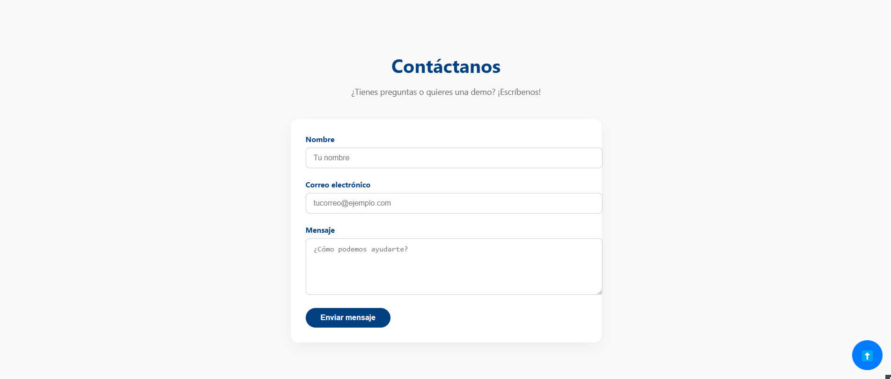
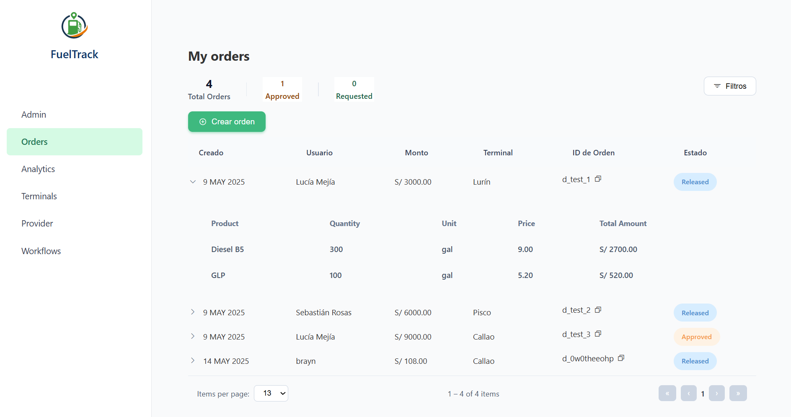
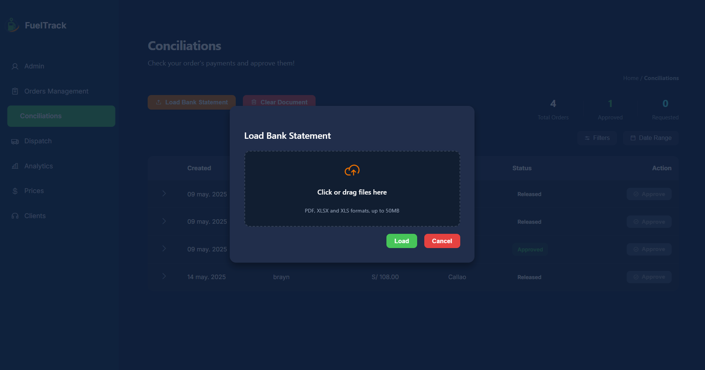

# 5.1. Software Configuration Management

## 5.1.1. Software Development Environment Configuration

### Project Management
- **WhatsApp**: Aplicación de mensajería instantánea de Meta, utilizada para coordinar tareas, compartir ideas y brindar soporte continuo durante el desarrollo del proyecto.
- **Google Meet**: Plataforma de videoconferencias empleada para reuniones virtuales, planificación colaborativa y comunicación directa entre los miembros del equipo.
- **Google Drive**: Servicio de almacenamiento en la nube que permite compartir documentos, archivos clave y recursos del proyecto de forma organizada.

### Requirements Management
- **UXPressia**: Herramienta especializada en la creación de User Personas, User Journey Maps e Impact Maps, que facilita una mejor comprensión de las necesidades y expectativas de los usuarios.
- **Zoom**: Utilizada para realizar entrevistas de exploración y validación con usuarios potenciales, recopilando información valiosa para definir requerimientos.

### Product UX/UI Design
- **Figma**: Plataforma colaborativa para el diseño de interfaces, wireframes, wireflows, mockups y prototipos interactivos, promoviendo una visión compartida del producto final.

### Software Deployment
- **GitHub**: Plataforma de control de versiones basada en Git, utilizada para alojar el repositorio del proyecto, gestionar ramas de desarrollo, automatizar despliegues y realizar seguimiento de issues.

### Software Development
- **JetBrains WebStorm** (o IntelliJ IDEA, según el stack): Entorno de desarrollo integrado empleado para programar y mantener todo el código del proyecto, incluyendo frontend, backend y lógica de negocio, con integración a GitHub para control de versiones.
- **Vertabelo**: Herramienta para modelado visual de bases de datos, que permite definir entidades, relaciones y estructuras de datos de manera clara y eficiente.
- **Google Chrome**: Navegador principal para realizar pruebas de compatibilidad, rendimiento y funcionalidad de la aplicación web.

### Software Documentation
- **Google Docs**: Herramienta de edición colaborativa para documentar decisiones, avances técnicos, acuerdos del equipo y requisitos funcionales.
- **Structurizr**: Plataforma para el modelado de arquitecturas de software utilizando diagramas C4, que representan visualmente los diferentes niveles de abstracción del sistema.

## 5.1.2. Source Code Management

El proyecto utiliza GitHub como repositorio para administrar y estructurar los avances. Implementamos el flujo de trabajo **Gitflow**, siguiendo la metodología propuesta por Vincent Driessen, para mantener versiones estables y trabajo colaborativo ordenado.

**Main branch:** Rama principal donde se almacena el código de producción estable.

**Develop branch:** Rama de integración donde se fusionan las nuevas funcionalidades desarrolladas.

**Feature branches:** Ramas creadas a partir de `develop` para desarrollar funcionalidades específicas. Cada feature se trabaja de forma aislada para evitar conflictos.

**Conventional Commits:** Estándar aplicado en los mensajes de commit para mantener un historial de cambios claro, comprensible y trazable, mejorando además la automatización de flujos de despliegue.

## 5.1.3. Source Code Style Guide & Conventions

Nuestro equipo adoptó las siguientes convenciones de estilo para los lenguajes utilizados, buscando mantener la consistencia, la legibilidad y la facilidad de mantenimiento del código.

**HTML:**
- Elementos y atributos en minúsculas.
- Cierre explícito de todas las etiquetas.
- Inclusión de atributos requeridos como `alt` en imágenes y `id`, `name` en formularios.
- Código estructurado para mejorar la legibilidad.

**CSS:**
- Uso de nombres de clases en kebab-case.
- Espaciado consistente y cierre obligatorio de declaraciones con punto y coma.
- Organización modular de reglas CSS.

**JavaScript / Vue.js:**
- Declaración de variables con `const` y `let`.
- Componentes Vue nombrados usando PascalCase (`OrderForm.vue`).
- Estructura de componentes siguiendo el orden `template`, `script`, `style`.
- Código y comentarios en inglés.
- Uso de programación funcional, separación de responsabilidades, y aplicación de mejores prácticas recomendadas por la [Vue 3 Style Guide](https://vuejs.org/style-guide/).

## 5.1.4. Software Deployment Configuration

**Entorno de Desarrollo:**

Tecnologías utilizadas:
- HTML5
- CSS3
- JavaScript
- Vue 3 (con Vite como empaquetador y servidor de desarrollo)

Gestor de paquetes:
- **npm** para Vue 3 (administración de dependencias y scripts de build).

**Estrategia de Deployment:**
- **GitHub Pages** para desplegar la versión estática del Landing Page.
- **Azure App Services** para desplegar los servicios backend (API RESTful).

**Flujo Gitflow aplicado:**
- `main`: Rama principal de producción.
- `develop`: Rama de integración principal.
- `feature/*`: Desarrollo de nuevas funcionalidades sobre `develop`.
- Pull Requests realizados desde `feature/*` hacia `develop`, y de `develop` hacia `main` al completar un ciclo.

<h2>5.2. Landing Page, Services & Applications Implementation</h2>

<h3>5.2.1. Sprint 1</h3>

<h4>5.2.1.1. Sprint Planning 1</h4>

<table border="1" cellspacing="0" cellpadding="6">
  <tr><th><strong>Sprint #</strong></th><td>Sprint 1</td></tr>
  <tr><th><strong>Resumen del Sprint Planning</strong></th><td></td></tr>
  <tr><th><strong>Fecha</strong></th><td>2025-04-26</td></tr>
  <tr><th><strong>Hora</strong></th><td>6:00 PM</td></tr>
  <tr><th><strong>Ubicación</strong></th><td>Google Meet</td></tr>
  <tr><th><strong>Preparado por</strong></th><td>Manuel Angel Sanchez Arenas</td></tr>
  <tr><th><strong>Asistentes a la reunión de planificación</strong></th>
    <td>
      Bryan Ronald Espejo Gamarra, 
      Manuel Angel Sanchez Arenas, 
      Juan Diego Javier Mondoñedo Rodriguez, 
      Diego Vicente Seminario Castillo
    </td>
  </tr>
  <tr><th><strong>Resumen del Sprint 0 (Revisión)</strong></th><td>No hubo Sprint 0 previo.</td></tr>
  <tr><th><strong>Resumen del Sprint 0 (Retrospectiva)</strong></th><td>No hubo Sprint 0 previo.</td></tr>
</table>

<h4>Objetivo del Sprint y User Stories</h4>

<table border="1" cellspacing="0" cellpadding="6">
  <tr>
    <th><strong>Ítem</strong></th>
    <th><strong>Descripción</strong></th>
  </tr>
  <tr>
    <td><strong>Objetivo del Sprint 1</strong></td>
    <td>
      Nuestro enfoque está en implementar la versión inicial de la Landing Page de FuelTrack. 
      Creemos que entrega una primera aproximación completa de la plataforma a los clientes. 
      Esto se confirmará cuando la Landing Page esté desplegada en vivo en GitHub Pages y accesible desde cualquier dispositivo.
    </td>
  </tr>
  <tr>
    <td><strong>Velocidad del Sprint 1</strong></td>
    <td>16 Story Points</td>
  </tr>
  <tr>
    <td><strong>Suma de Story Points</strong></td>
    <td>16</td>
  </tr>
</table>

---

<h4>5.2.1.2. Líderes y Colaboradores por Áreas</h4>

<table border="1" cellspacing="0" cellpadding="6">
  <thead>
    <tr>
      <th>Miembro del equipo (Apellido, Nombre)</th>
      <th>Usuario de GitHub</th>
      <th>Landing Page (L/C)</th>
      <th>Login y Autenticación (L/C)</th>
      <th>Documentación (L/C)</th>
    </tr>
  </thead>
  <tbody>
    <tr>
      <td>Espejo Gamarra, Bryan Ronald</td>
      <td>SaeBryxn</td>
      <td>L</td>
      <td>C</td>
      <td>C</td>
    </tr>
    <tr>
      <td>Sanchez Arenas, Manuel Angel</td>
      <td>manuels7a</td>
      <td>C</td>
      <td>L</td>
      <td>C</td>
    </tr>
    <tr>
      <td>Mondoñedo Rodriguez, Juan Diego Javier</td>
      <td>Jmondonedor</td>
      <td>C</td>
      <td>C</td>
      <td>L</td>
    </tr>
    <tr>
      <td>Seminario Castillo, Diego Vicente</td>
      <td>DiegoSeminario</td>
      <td>C</td>
      <td>C</td>
      <td>C</td>
    </tr>
    <tr>
      <td>Navarro Correa, César Augusto</td>
      <td>csr555-ui</td>
      <td>C</td>
      <td>C</td>
      <td>C</td>
    </tr>
  </tbody>
</table>

### 5.2.1.3. Sprint Backlog 1
**Sprint Objective:**
Implementar funcionalidades básicas para el registro, gestión de pedidos y autenticación de usuarios en FuelTrack.

<h4>Tabla de Sprint Backlog</h4>

<table border="1" cellspacing="0" cellpadding="6">
  <thead>
    <tr>
      <th>Historia de Usuario</th>
      <th>Elemento de trabajo / Tarea</th>
      <th>Descripción</th>
      <th>Estimación (Horas)</th>
      <th>Asignado a</th>
      <th>Estado</th>
    </tr>
  </thead>
  <tbody>
    <tr>
      <td>US13</td>
      <td>Implementar visualización del Landing Page</td>
      <td>Mostrar una landing page informativa para que los interesados conozcan la plataforma antes de registrarse.</td>
      <td>5</td>
      <td>Bryan Ronald Espejo Gamarra</td>
      <td>Finalizado</td>
    </tr>
    <tr>
      <td>EP04</td>
      <td>Landing Page informativa y funcional</td>
      <td>Landing page con secciones informativas, beneficios, segmentos y botones que dirigen a login o registro.</td>
      <td>6</td>
      <td>Manuel Angel Sanchez Arenas</td>
      <td>Finalizado</td>
    </tr>
  </tbody>
</table>

<h4>5.2.1.4. Development Evidence for Sprint Review</h4>

<strong>Resumen:</strong> 
Durante este Sprint, el equipo implementó y desplegó con éxito la versión inicial de la Landing Page de FuelTrack. Los commits relacionados con estos avances se detallan a continuación.

<h4>5.2.1.5. Tabla de Commits</h4>

<strong>Resumen:</strong> Esta tabla lista los commits realizados durante los primeros sprints de desarrollo, incluyendo el trabajo en la Landing Page, documentación y configuración del proyecto.

<table border="1" cellspacing="0" cellpadding="6">
  <thead>
    <tr>
      <th>Repositorio</th>
      <th>Rama</th>
      <th>ID de Commit</th>
      <th>Mensaje de Commit</th>
      <th>Descripción del Commit</th>
      <th>Fecha de Commit</th>
    </tr>
  </thead>
<tbody>
  <tr><td>1ASI0730-2510-4374-G3-FuelTrack</td><td>main</td><td>4024b94</td><td>Initial commit</td><td>-</td><td>09/04/2025</td></tr>
  <tr><td>1ASI0730-2510-4374-G3-FuelTrack</td><td>develop</td><td>4024b94</td><td>Initial commit</td><td>-</td><td>09/04/2025</td></tr>
  <tr><td>1ASI0730-2510-4374-G3-FuelTrack</td><td>feature/chapter1-introduction</td><td>4024b94</td><td>Initial commit</td><td>-</td><td>09/04/2025</td></tr>
  <tr><td>1ASI0730-2510-4374-G3-FuelTrack</td><td>feature/chapter1-introduction</td><td>4024b94</td><td>docs: add initial version of chapter1.md</td><td>-</td><td>09/04/2025</td></tr>
  <tr><td>1ASI0730-2510-4374-G3-FuelTrack</td><td>feature/chapter1-introduction</td><td>521cd4f</td><td>docs: add initial version of chapter1.md</td><td>-</td><td>09/04/2025</td></tr>
  <tr><td>1ASI0730-2510-4374-G3-FuelTrack</td><td>develop</td><td>e1767e7</td><td>Merge pull request #1 from feature/chapter1-introduction</td><td>-</td><td>09/04/2025</td></tr>
  <tr><td>1ASI0730-2510-4374-G3-FuelTrack</td><td>develop</td><td>15dd9e2</td><td>Merge pull request #2 from feature/chapter1-introduction</td><td>-</td><td>09/04/2025</td></tr>
  <tr><td>1ASI0730-2510-4374-G3-FuelTrack</td><td>feature/chapter1-introduction</td><td>c96c7bf</td><td>docs: update introduction with project description and team member profiles</td><td>-</td><td>10/04/2025</td></tr>
  <tr><td>1ASI0730-2510-4374-G3-FuelTrack</td><td>feature/chapter1-introduction</td><td>1edda67</td><td>feat(assets): add company logo to the report</td><td>-</td><td>10/04/2025</td></tr>
  <tr><td>1ASI0730-2510-4374-G3-FuelTrack</td><td>feature/chapter1-introduction</td><td>f3d3494</td><td>Update chapter1.md</td><td>Added Lean UX Problem Statement</td><td>12/04/2025</td></tr>
  <tr><td>1ASI0730-2510-4374-G3-FuelTrack</td><td>feature/chapter1-introduction</td><td>565cf3e</td><td>Update chapter1.md</td><td>Added Lean UX Assumptions</td><td>12/04/2025</td></tr>
  <tr><td>1ASI0730-2510-4374-G3-FuelTrack</td><td>feature/chapter1-introduction</td><td>6782a2d</td><td>Update chapter1.md</td><td>Added Lean UX Hypothesis statements</td><td>12/04/2025</td></tr>
  <tr><td>1ASI0730-2510-4374-G3-FuelTrack</td><td>feature/chapter1-introduction</td><td>b2b4e93</td><td>Update chapter1.md</td><td>Added Lean UX Hypothesis statements</td><td>13/04/2025</td></tr>
  <tr><td>1ASI0730-2510-4374-G3-FuelTrack</td><td>feature/chapter1-introduction</td><td>b64269b</td><td>chapter1 - profile and personal data</td><td>-</td><td>13/04/2025</td></tr>
  <tr><td>1ASI0730-2510-4374-G3-FuelTrack</td><td>feature/chapter1-introduction</td><td>6aaeb8d</td><td>update - added chapter 2 (competitors/competitive analysis/strategies and tactics against competitors/interview design)</td><td>-</td><td>13/04/2025</td></tr>
  <tr><td>1ASI0730-2510-4374-G3-FuelTrack</td><td>feature/chapter1-introduction</td><td>5850634</td><td>docs: refine Lean UX Process with clearer structure and aligned template</td><td>-</td><td>15/04/2025</td></tr>
  <tr><td>1ASI0730-2510-4374-G3-FuelTrack</td><td>feature/chapter2-Requirements-Elicitation-&-Analysis</td><td>38aee6c</td><td>3.1 To-Be Scenario</td><td>Added To-Be Scenario</td><td>18/04/2025</td></tr>
  <tr><td>1ASI0730-2510-4374-G3-FuelTrack</td><td>feature/chapter2-Requirements-Elicitation-&-Analysis</td><td>1e1693f</td><td>3.2 User stories</td><td>Added section 3.2, with 3 Epics and 12 User Stories.</td><td>18/04/2025</td></tr>
  <tr><td>1ASI0730-2510-4374-G3-FuelTrack</td><td>feature/chapter3-Requirements-Specifications</td><td>b2fcfde</td><td>docs: Add Impact Map image</td><td>-</td><td>20/04/2025</td></tr>
  <tr><td>1ASI0730-2510-4374-G3-FuelTrack</td><td>feature/chapter3-Requirements-Specifications</td><td>32e7c56</td><td>docs: Update chapter3 Add Impact Map/Product Backlog.md</td><td>-</td><td>20/04/2025</td></tr>
  <tr><td>1ASI0730-2510-4374-G3-FuelTrack</td><td>feature/chapter3-Requirements-Specifications</td><td>75af16d</td><td>add: interviews</td><td>-</td><td>26/04/2025</td></tr>
  <tr><td>1ASI0730-2510-4374-G3-FuelTrack</td><td>feature/chapter4-Product-design</td><td>146b38c</td><td>docs: Create chapter4.md</td><td>-</td><td>26/04/2025</td></tr>
  <tr><td>1ASI0730-2510-4374-G3-FuelTrack</td><td>feature/chapter4-Product-design</td><td>ac37eb8</td><td>docs: Create chapter5.md</td><td>-</td><td>26/04/2025</td></tr>
  <tr><td>1ASI0730-2510-4374-G3-FuelTrack</td><td>feature/chapter4-Product-design</td><td>6cc5367</td><td>docs: created asset directory and added database.erd</td><td>-</td><td>26/04/2025</td></tr>
  <tr><td>1ASI0730-2510-4374-G3-FuelTrack</td><td>feature/chapter4-Product-design</td><td>b8859e6</td><td>docs: add Style Guidelines for landing page and branding</td><td>-</td><td>26/04/2025</td></tr>
  <tr><td>1ASI0730-2510-4374-G3-FuelTrack</td><td>feature/chapter4-Product-design</td><td>3e1fe98</td><td>docs: add Information Architecture and navigation systems</td><td>-</td><td>26/04/2025</td></tr>
  <tr><td>1ASI0730-2510-4374-G3-FuelTrack</td><td>feature/chapter4-Product-design</td><td>4bd79dd</td><td>docs: add initial structure for Landing Page UI Design</td><td>-</td><td>26/04/2025</td></tr>
  <tr><td>1ASI0730-2510-4374-G3-FuelTrack</td><td>feature/chapter4-Product-design</td><td>a15affe</td><td>docs: add initial structure for Web Applications UX/UI Design</td><td>-</td><td>26/04/2025</td></tr>
  <tr><td>1ASI0730-2510-4374-G3-FuelTrack</td><td>feature/chapter4-Product-design</td><td>c2c2a26</td><td>docs: add initial structure for Web Applications Prototyping</td><td>-</td><td>26/04/2025</td></tr>
  <tr><td>1ASI0730-2510-4374-G3-FuelTrack</td><td>feature/chapter4-Product-design</td><td>89a0dcb</td><td>docs: add Domain-Driven Software Architecture and C4 diagrams</td><td>-</td><td>26/04/2025</td></tr>
  <tr><td>1ASI0730-2510-4374-G3-FuelTrack</td><td>feature/chapter4-Product-design</td><td>145e64b</td><td>docs: add structure for Software Object-Oriented Design</td><td>-</td><td>26/04/2025</td></tr>
  <tr><td>1ASI0730-2510-4374-G3-FuelTrack</td><td>feature/chapter4-Product-design</td><td>09d785c</td><td>docs: add Database Design and relational diagram</td><td>-</td><td>26/04/2025</td></tr>
  <tr><td>1ASI0730-2510-4374-G3-FuelTrack</td><td>feature/chapter4-Product-design</td><td>dd94d03</td><td>docs: added section 4.2.2</td><td>-</td><td>26/04/2025</td></tr>
  <tr><td>1ASI0730-2510-4374-G3-FuelTrack</td><td>feature/chapter5-Product-Implementation-&-Deployment</td><td>c2169d0</td><td>feat(docs): add full Chapter 5 structure (Software Configuration Management and Implementation)</td><td>-</td><td>26/04/2025</td></tr>
  <tr><td>1ASI0730-2510-4374-G3-FuelTrack</td><td>feature/chapter5-Product-Implementation-&-Deployment</td><td>153ae34</td><td>feat(docs): add Sprint Backlog 1 with assigned tasks</td><td>-</td><td>26/04/2025</td></tr>
  <tr><td>1ASI0730-2510-4374-G3-FuelTrack</td><td>feature/chapter5-Product-Implementation-&-Deployment</td><td>a1532b8</td><td>feat(docs): update software configuration and development environment description</td><td>-</td><td>26/04/2025</td></tr>
  <tr><td>1ASI0730-2510-4374-G3-FuelTrack</td><td>feature/chapter5-Product-Implementation-&-Deployment</td><td>1d5d90c</td><td>feat(docs): add Execution Evidence with Landing Page screenshots</td><td>-</td><td>26/04/2025</td></tr>
  <tr><td>1ASI0730-2510-4374-G3-FuelTrack</td><td>feature/chapter5-Product-Implementation-&-Deployment</td><td>0c8998d</td><td>feat(docs): add Sprint Planning 1 and Aspect Leaders table</td><td>-</td><td>26/04/2025</td></tr>
  <tr><td>1ASI0730-2510-4374-G3-FuelTrack</td><td>feature/chapter5-Product-Implementation-&-Deployment</td><td>693b39e</td><td>fix(docs): complete Aspect Leaders and Collaborators table with GitHub usernames</td><td>-</td><td>26/04/2025</td></tr>
  <tr><td>1ASI0730-2510-4374-G3-FuelTrack</td><td>feature/chapter5-Product-Implementation-&-Deployment</td><td>a523d83</td><td>fix(docs): minor corrections and cleanup</td><td>-</td><td>26/04/2025</td></tr>
</tbody>

</table>

---

<h3>5.2.1.5. Execution Evidence for Sprint Review</h3>

<strong>Resumen:</strong> 
Las principales secciones de la Landing Page de FuelTrack fueron desarrolladas y desplegadas exitosamente. A continuación se presentan capturas de pantalla de las secciones implementadas.

<h5>Evidencia de Capturas:</h5>
<ul>
  <li><strong>Hero Section</strong> </li>
  <li><strong>Features Section 1</strong> </li>
  <li><strong>Features Section 2</strong> </li>
  <li><strong>Welcome Section</strong> </li>
  <li><strong>Pricing Section</strong> </li>
  <li><strong>Testimonial Section</strong> </li>
  <li><strong>Contact Section</strong> </li>
</ul>

<strong>Enlace a Demo en Vivo:</strong> 
<a href="https://1asi0730-2510-4374-g3-fueltrack.github.io/Landing-page/" target="_blank">FuelTrack Landing Page</a>

<h4>5.2.1.6. Services Documentation Evidence for Sprint Review</h4>

Durante el Sprint 1, el equipo logró implementar y desplegar la Landing Page de FuelTrack, lo que representa el primer entregable visible y funcional del producto. Esta incluye secciones informativas sobre la plataforma, beneficios clave para los usuarios, diferenciación por tipo de usuario, y botones de acción que direccionan al login o registro.

Además, se configuró el entorno de desarrollo, se definieron los flujos de trabajo con Gitflow y se establecieron las convenciones de codificación. Los avances fueron registrados mediante commits con convenciones semánticas y organizados a través de su propio repositorio.

Logros Clave:
- Desarrollo completo de la Landing Page (HTML, CSS, Vue 3).
- Implementación de componentes reutilizables en PrimeVue.
- Diseño responsive validado en Chrome y Firefox.
- Despliegue exitoso en GitHub Pages: fueltrack.github.io
- Documentación del entorno y arquitectura en Structurizr y Google Docs.
- Flujo Gitflow aplicado y validado con múltiples merges y ramas feature.
- Participación activa de todos los miembros del equipo según el plan establecido.

<h3>5.2.1.7. Software Deployment Evidence for Sprint Review</h3>

<strong>Resumen:</strong> 
El despliegue inicial de la Landing Page de FuelTrack fue realizado exitosamente utilizando GitHub Pages.

<h5>Detalles del Despliegue:</h5>
<ul>
  <li><strong>URL de la Landing Page:</strong> <a href="https://1asi0730-2510-4374-g3-fueltrack.github.io/Landing-page/" target="_blank">https://1asi0730-2510-4374-g3-fueltrack.github.io/Landing-page/</a></li>
  <li><strong>Repositorio:</strong> <a href="https://github.com/1ASI0730-2510-4374-G3-FuelTrack/Landing-page" target="_blank">https://github.com/1ASI0730-2510-4374-G3-FuelTrack/Landing-page</a></li>
</ul>

<h5>Actividades de Despliegue:</h5>
<ul>
  <li>Configuración del repositorio con GitHub Pages.</li>
  <li>Construcción y despliegue del sitio estático generado con Vite (Vue 3) a la rama <code>gh-pages</code>.</li>
</ul>

<h3>5.2.1.8. Team Collaboration Insights during Sprint</h3>

<strong>Resumen:</strong> 
El equipo colaboró mediante GitHub y WhatsApp durante el Sprint. Las actividades principales se centraron en el desarrollo y despliegue de la Landing Page.

<h5>Evidencia de Colaboración:</h5>
<ul>
  <li>Captura de pantalla de commits en GitHub mostrando contribuciones del equipo.</li>
  <li>Conversaciones de WhatsApp sobre coordinación de secciones y ajustes de diseño.</li>
</ul>

<h5>Principales Herramientas de Comunicación:</h5>
<ul>
  <li>GitHub (control de versiones y manejo de issues)</li>
  <li>WhatsApp (comunicación diaria y aclaraciones rápidas)</li>
  <li>Google Meet (reuniones de planificación de sprint)</li>
</ul>

<h3>5.2.2 Sprint 2</h3>

<h4>5.2.2.1. Sprint Planning 2</h4>

<table border="1" cellspacing="0" cellpadding="6">
  <tr><th><strong>Sprint #</strong></th><td>Sprint 2</td></tr>
  <tr><th><strong>Resumen del Sprint Planning</strong></th><td>---</td></tr>
  <tr><th><strong>Fecha</strong></th><td>2025-05-09</td></tr>
  <tr><th><strong>Hora</strong></th><td>11:00 PM</td></tr>
  <tr><th><strong>Ubicación</strong></th><td>Google Meet</td></tr>
  <tr><th><strong>Preparado por</strong></th><td>Manuel Angel Sanchez Arenas</td></tr>
  <tr><th><strong>Asistentes a la reunión de planificación</strong></th>
    <td>
      Bryan Ronald Espejo Gamarra, 
      Manuel Angel Sanchez Arenas, 
      Juan Diego Javier Mondoñedo Rodríguez, 
      Diego Vicente Seminario Castillo 
	  Cesar Augusto Navarro Correa
    </td>
  </tr>
  <tr><th><strong>Resumen del Sprint 1 (Revisión)</strong></th><td>Creación de un nuevo repositorio para el Frontend y asignación de tareas para implementar sus funciones para los solicitantes y proveedores</td></tr>
  <tr><th><strong>Resumen del Sprint 1 (Retrospectiva)</strong></th><td>Realización de la primera versión del Landing y documentación de las tareas y los cambios realizados</td></tr>
</table>

<h4>Objetivo del Sprint y User Stories</h4>

<table border="1" cellspacing="0" cellpadding="6">
  <tr>
    <th><strong>Ítem</strong></th>
    <th><strong>Descripción</strong></th>
  </tr>
  <tr>
    <td><strong>Objetivo del Sprint 2</strong></td>
    <td>
      Nuestro enfoque está en implementar la versión inicial del Frontend de la pagina web de FuelTrack. 
      Creemos que esto será un aproximado de como los usuarios van a interactuar y a utilizar la plataforma. 
      Esto se confirmará cuando la pagina web esté desplegada en vivo en GitHub Pages y accesible desde cualquier dispositivo.
    </td>
  </tr>
  <tr>
    <td><strong>Velocidad del Sprint 2</strong></td>
    <td>55 Story Points</td>
  </tr>
  <tr>
    <td><strong>Suma de Story Points</strong></td>
    <td>55</td>
  </tr>
</table>

---

<h4>5.2.2.2. Líderes y Colaboradores por Áreas</h4>

<table border="1" cellspacing="0" cellpadding="6">
  <thead>
    <tr>
      <th>Miembro del equipo (Apellido, Nombre)</th>
      <th>Usuario de GitHub</th>
      <th>Frontend Client (L/C)</th>
      <th>Frontend Supplier (L/C)</th>
      <th>Documentación (L/C)</th>
    </tr>
  </thead>
  <tbody>
    <tr>
      <td>Espejo Gamarra, Bryan Ronald</td>
      <td>SaeBryxn</td>
      <td>L</td>
      <td>C</td>
      <td>C</td>
    </tr>
    <tr>
      <td>Sanchez Arenas, Manuel Angel</td>
      <td>manuels7a</td>
      <td>C</td>
      <td>C</td>
      <td>C</td>
    </tr>
    <tr>
      <td>Mondoñedo Rodriguez, Juan Diego Javier</td>
      <td>Jmondonedor</td>
      <td>C</td>
      <td>L</td>
      <td>C</td>
    </tr>
    <tr>
      <td>Seminario Castillo, Diego Vicente</td>
      <td>DiegoSeminario</td>
      <td>C</td>
      <td>C</td>
      <td>C</td>
    </tr>
    <tr>
      <td>Navarro Correa, César Augusto</td>
      <td>csr555-ui</td>
      <td>C</td>
      <td>C</td>
      <td>C</td>
    </tr>
  </tbody>
</table>

### 5.2.2.3. Sprint Backlog 2
**Sprint Objective:**
Implementar funcionalidades básicas para el registro, gestión de pedidos y autenticación de usuarios en FuelTrack.

<h4>Tabla de Sprint Backlog</h4>

<table border="1" cellspacing="0" cellpadding="6">
  <thead>
    <tr>
      <th>Historia de Usuario</th>
      <th>Elemento de trabajo / Tarea</th>
      <th>Descripción</th>
      <th>Estimación (Horas)</th>
      <th>Asignado a</th>
      <th>Estado</th>
    </tr>
  </thead>
  <tbody>
    <tr>
      <td>US01</td>
      <td>Crear nuevo pedido</td>
      <td>Como usuario de una empresa solicitante, quiero poder registrar un pedido directamente desde la plataforma agilizar el proceso y evitar llamadas.</td>
      <td>6</td>
      <td>Bryan Ronald Espejo Gamarra</td>
      <td>Finalizado</td>
    </tr>
    <tr>
      <td>US02</td>
      <td>Consultar historial de pedidos</td>
      <td>Como solicitante, quiero poder consultar mi historial de pedidos anteriores, y poder ver cada uno con información detallada. Además, debo ser capaz de filtrar y ordenar el historial según características específicas de los pedidos.</td>
      <td>4</td>
      <td>Bryan Ronald Espejo Gamarra</td>
      <td>Finalizado</td>
    </tr>
    <tr>
       <td>US03</td>
      <td>Editar pedidos</td>
      <td>Como solicitante, quiero tener la posibilidad de editar parámetros, como el monto o dirección de entrega, de mis pedidos siempre y cuando estos todavía no hayan sido confirmados por el rpoovedor</td>
      <td>5</td>
      <td>Bryan Ronald Espejo Gamarra</td>
      <td>Finalizado</td>
    </tr>
    <tr>
      <td>US04</td>
      <td>Confirmar pedido recibido</td>
      <td>Como proveedor, quiero revisar y confirmar los datos del pedido desde mi panel para asegurar que el pedido será atendido correctamente.</td>
      <td>5</td>
      <td>Juan Diego Javier Mondoñedo Rodriguez</td>
      <td>Finalizado</td>
    </tr>
    <tr>
       <td>US05</td>
      <td>Actualización de un pedido</td>
      <td>Como proveedor de combustible, quiero poder actualizar el estado e información de los pedidos en tiempo real, para mantener a mis clientes informados y organizar mejor mis entregas.</td>
      <td>4</td>
      <td>Juan Diego Javier Mondoñedo Rodriguez</td>
      <td>Finalizado</td>
    </tr>
    <tr>
       <td>US06</td>
      <td>Notificaciones a clientes sobre cambios</td>
      <td>Como proovedor, quiero que mis clientes reciban notificaciones automáticas cuando actualizo un pedido, para que estén al tanto del progreso sin tener que llamarlos.</td>
      <td>4</td>
      <td>Bryan Ronald Espejo Gamarra</td>
      <td>En Proceso</td>
    </tr>
    <tr>
       <td>US07</td>
      <td>Cancelación o rechazo de pedidos</td>
      <td>Como proveedor de combustible, quiero poder rechazar o cancelar un pedido y enviar un mensaje al cliente explicando los motivos, para mantener una comunicación clara y evitar confusiones.</td>
      <td>5</td>
      <td>Bryan Ronald Espejo Gamarra</td>
      <td>Finalizado</td>
    </tr>
    <tr>
      <td>US08</td>
      <td>Inicio de sesión</td>
      <td>Como usuario registrado, quiero iniciar sesión con mi correo y contraseña, para acceder a mi cuenta de forma segura.</td>
      <td>4</td>
      <td>Juan Diego Javier Mondoñedo Rodriguez</td>
      <td>Finalizado</td>
    </tr>
    <tr>
      <td>US09</td>
      <td>Registro de cuenta nueva</td>
      <td>Como visitante, Quiero crear una cuenta con correo, contraseña y rol (cliente o proveedor), Para acceder y comenzar a utilizar la plataforma.</td>
      <td>4</td>
      <td>Juan Diego Javier Mondoñedo Rodriguez</td>
      <td>Finalizado</td>
    </tr>
    <tr>
      <td>US10</td>
      <td>Recuperación de contraseña</td>
      <td>Como usuario, Quiero tener la posibilidad de recuperar mi contraseña mediante correo electrónico, Para no perder el acceso a mi cuenta en caso la olvide.</td>
      <td>5</td>
      <td>Bryan Ronald Espejo GamarraEP03</td>
      <td>En Proceso</td>
    </tr>
    <tr>
      <td>US11</td>
      <td>Acceso restringido por roles</td>
      <td>Como administrador de la plataforma, Quiero que los usuarios solo accedan a las secciones según su tipo de cuenta, Para evitar errores en el sistema</td></td>
      <td>4</td>
      <td>Juan Diego Javier Mondoñedo Rodriguez</td>
      <td>Finalizado</td>
    </tr>
    <tr>
      <td>US12</td>
      <td>Autenticación MFA para realizar pedidos</td>
      <td>Como empresa solicitante, Quiero que se me solicite una autenticación multifactor al momento de realizar un pedido, Para asegurar que solo personal autorizado pueda emitir órdenes de compra</td>
      <td>5</td>
      <td>Bryan Ronald Espejo Gamarra</td>
      <td>En Proceso</td>
    </tr>
  </tbody>
</table>

<h4>5.2.1.4. Development Evidence for Sprint Review</h4>

<strong>Resumen:</strong> 

<h4>5.2.1.5. Tabla de Commits</h4>
<table border="1" cellspacing="0" cellpadding="6">
  <thead>
    <tr>
      <th>Repositorio</th>
      <th>Rama</th>
      <th>ID de Commit</th>
      <th>Mensaje de Commit</th>
      <th>Descripción del Commit</th>
      <th>Fecha de Commit</th>
    </tr>
  </thead>
<tbody>
  <tr><td>1ASI0730-2510-4374-G3-FuelTrack/Frontend</td><td>orders</td><td>a08bbae</td><td>Primer commit de mi proyecto frontend</td><td></td><td>10/05/2025</td></tr>
<tr><td>1ASI0730-2510-4374-G3-FuelTrack/Frontend</td><td>orders</td><td>04ab76a</td><td>feat: reorganize and refactor project structure</td><td>

- Moved and renamed files for improved clarity (e.g., <code>api.js</code>, <code>authService.js</code>, <code>index.js</code>)

- Added and updated Vue components for client and supplier (<code>LoginClient.vue</code>, <code>LoginSupplier.vue</code>, 
<code>OrderDetails.vue</code>, <code>OrdersList.vue</code>, <code>SupplierOrders.vue</code>, <code>Dispatch.vue</code>)

- Updated service logic (<code>fuelService.js</code>, <code>api.ts</code>)

- Updated project metadata (<code>package.json</code>, <code>package-lock.json</code>)

- Minor updates to <code>index.html</code> and <code>main.js</code>

- Added mock data file <code>db.json</code>
</td><td>13/05/2025</td></tr>
<tr><td>1ASI0730-2510-4374-G3-FuelTrack/Frontend</td><td>orders</td><td>685ee5f</td><td>feat: add analytics and order modules with components, services, and models</td><td>

- Added analytics module: views, components, models, and services (<code>AnalyticsDashboard.vue</code>, <code>AnalyticsHeader.vue</code>, <code>analyticsService.js</code>, etc.)

- Integrated new order management components and models (<code>OrderDetails.vue</code>, <code>CreateOrderModal.vue</code>, <code>StepConfirmOrder.vue</code>, etc.)

- Refactored and organized client order and supplier views

- Updated shared enums, pagination, filters, and progress stepper

- Included mock data and updated package files (<code>db.json</code>, <code>package.json</code>, etc.)

- Improved file naming for consistency (<code>authService</code>, <code>index.js</code>)
</td><td>13/05/25</td></tr>
<tr><td>1ASI0730-2510-4374-G3-FuelTrack/Frontend</td><td>orders</td><td>ff26968</td><td>chore: update routing, client login, and project metadata</td><td>

- Updated <code>index.js</code> for routing improvements

- Refined client login component (<code>LoginClient.vue</code>) for better UI/UX

- Added mock data file (<code>db.json</code>) for development purposes

- Updated project metadata with changes to <code>package.json</code> and <code>package-lock.json</code>
</td><td>13/05/25</td></tr>
<tr><td>1ASI0730-2510-4374-G3-FuelTrack/Frontend</td><td>orders</td><td>3c9986b</td><td>feat: add provider and terminal modules with components and services</td><td>

- Added provider dashboard, stats, and workflow components (<code>ProviderDashboard.vue</code>, <code>ProviderList.vue</code>, <code>ProviderStats.vue</code>`, etc.) 

- Integrated terminal management components and services (<code>TerminalComparisonChart.vue</code>, <code>TerminalsDashboard.vue</code>, <code>TruckMap.vue</code>, etc.) 

- Updated provider and terminal models, including services for data handling (<code>providerService.js</code>, <code>terminalService.js</code>, <code>Truck.js</code>, etc.)

- Added workflow and map components for managing operations (<code>WorkflowMap.vue</code>, <code>WorkflowDashboard.vue</code>, etc.)

- Implemented new store logic with <code>useProviderStore.js</code>
</td><td>13/05/25</td></tr>
<tr><td>1ASI0730-2510-4374-G3-FuelTrack/Frontend</td><td>orders</td><td>2678f3d</td><td>Updated components and pages for supplier views</td><td></td><td>13/05/25</td></tr>
<tr><td>1ASI0730-2510-4374-G3-FuelTrack/Frontend</td><td>orders</td><td>d759683</td><td>feat(orders-management): add supplier order management view with filters, table, pagination and services</td><td></td><td>13/05/25</td></tr>
<tr><td>1ASI0730-2510-4374-G3-FuelTrack/Frontend</td><td>orders</td><td>22103a2</td><td>feat(supplier): add login logic, dashboard layout, routing and sidebar component</td><td></td><td>13/05/25</td></tr>
<tr><td>1ASI0730-2510-4374-G3-FuelTrack/Frontend</td><td>orders</td><td>fd43fc2</td><td>feat(router): add new routes and update db.json with matching mock data</td><td></td><td>13/05/25</td></tr>
<tr><td>1ASI0730-2510-4374-G3-FuelTrack/Frontend</td><td>orders</td><td>614b7f6</td><td>feat(conciliations): implement supplier reconciliation dashboard with table, models, actions and detailed views</td><td></td><td>13/05/25</td></tr>
<tr><td>1ASI0730-2510-4374-G3-FuelTrack/Frontend</td><td>orders</td><td>2b16d9c</td><td>feat: implement full conciliation and dispatch flows + UI enhancements and API integration</td><td><ul>
  <li>Added full conciliation module for suppliers:
    <ul>
      <li>Models: <code>ConciliationOrder.js</code></li>
      <li>Services: <code>conciliationService.js</code></li>
      <li>Components: <code>ConciliationRow.vue</code>, <code>ConciliationsHeader.vue</code>, <code>ConciliationTable.vue</code></li>
      <li>Views: <code>ConciliationsDashboard.vue</code></li>
    </ul>
  </li>
  <li>Implemented dispatch header and integration for supplier flow (<code>DispatchHeader.vue</code>)</li>
  <li>Added document upload modal (<code>LoadDocumentModal.vue</code>) and styled file drop zone</li>
  <li>Improved <code>CreateOrderModal.vue</code> behavior and validation</li>
  <li>Refined client and supplier login pages (<code>LoginClient.vue</code>, <code>LoginSupplier.vue</code>)</li>
  <li>Updated global styles and toolbar alignment (<code>global.css</code>)</li>
  <li>Enhanced routing (<code>index.js</code> and API communication (<code>api.js</code>, <code>fuelService.js</code>, <code>orderService.js</code>, <code>analyticsService.js</code>)</li>
  <li>Updated JSON structure in <code>db.json</code> with conciliation and dispatch data</li>
  <li>Minor UI improvements and responsive adjustments across order and conciliation tables</li>
</ul>

This commit brings together UI, backend service, and API updates to enable a complete workflow for order conciliation, document upload, and dispatch assignment.

</td><td>14/05/25</td></tr>
<tr><td>1ASI0730-2510-4374-G3-FuelTrack/Frontend</td><td>orders</td><td>4a5090c</td><td>feat: add supplier analytics, client management, and dispatch modules with components and services</td><td><ul>
  <li>Implemented Supplier Analytics module:
    <ul>
      <li>Service: <code>analyticsService.js</code></li>
      <li>Components: <code>AnalyticsSummaryCard.vue</code>, <code>BarChartFuel.vue</code></li>
      <li>Utils: <code>chartUtils.js</code></li>
      <li>Routing support added in <code>index.js</code></li>
    </ul>
  </li>
  <li>Added Supplier Clients management:
    <ul>
      <li>View: <code>ClientsDashboard.vue</code></li>
      <li>Components: <code>ClientList.vue</code></li>
      <li>Service: <code>clientService.js</code></li>
      <li>Utilities: <code>clientUtils.js</code></li>
    </ul>
  </li>
  <li>Developed full Dispatch management module:
    <ul>
      <li>Views: <code>DispatchDashboard.vue</code></li>
      <li>Components: <code>AssignCargoModal.vue</code>, <code>DispatchRow.vue</code>, <code>DispatchTable.vue</code></li>
      <li>Services: <code>dispatchService.js</code></li>
      <li>Models: <code>DispatchOrder.js</code>, <code>Driver.js</code></li>
    </ul>
  </li>
  <li>Included missing model and utilities for dispatch and analytics workflows</li>
  <li>All components are fully integrated with the fake API and styled to match the supplier dashboard</li>
</ul>

This commit delivers a full set of supplier-side tools for operational management: dashboards, dispatch planning, analytics tracking, and client coordination.

</td><td>14/05/25</td></tr>
<tr><td>1ASI0730-2510-4374-G3-FuelTrack/Frontend</td><td>supplier</td><td>a08bbae</td><td>Primer commit de mi proyecto frontend</td><td></td><td>10/05/25</td></tr>
<tr><td>1ASI0730-2510-4374-G3-FuelTrack/Frontend</td><td>supplier</td><td>3e5ef93</td><td>fix: fixed route for login and added paths</td><td></td><td>13/05/25</td></tr>
<tr><td>1ASI0730-2510-4374-G3-FuelTrack/Frontend</td><td>supplier</td><td>7b93a96</td><td>fix: corrected login href</td><td></td><td>13/05/25</td></tr>
<tr><td>1ASI0730-2510-4374-G3-FuelTrack/Frontend</td><td>supplier</td><td>fb9c7c1</td><td>feat: added supplier login, sidebar and order-management</td><td></td><td>13/05/25</td></tr>
<tr><td>1ASI0730-2510-4374-G3-FuelTrack/Frontend</td><td>supplier</td><td>f14c700</td><td>fix: sidebar gap between items</td><td></td><td>13/05/25</td></tr>

 
</tbody>
</table>

---

<h3>5.2.1.5. Execution Evidence for Sprint Review</h3>

<strong>Resumen:</strong> 

Las principales secciones del Frontend de FuelTrack fueron desarrolladas y desplegadas exitosamente. A continuación se presentan capturas de pantalla de las secciones implementadas.

<h5>Evidencia de Capturas:</h5>
<strong>Solicitantes</strong>
<ul>
  <li><strong>Orders Client Section</strong> </li>
  <li><strong>Orders Client Section 2</strong> </li>
  <li><strong>Orders Client Section 3</strong> </li>
  <li><strong>Orders Client Section 4</strong> </li>
  <li><strong>Analytics Client Section</strong> </li>
  <li><strong>Analytics Client Section 2</strong> </li>
  <li><strong>Terminals Client Section</strong> </li>
   <li><strong>Terminals Client Section 2</strong> </li>
   <li><strong>Provider Client Section</strong> </li>
   <li><strong>Workflows Client Section</strong> </li>
</ul>
<strong>Proveedores</strong>
<ul>
   <li><strong>Orders Supplier Section</strong> </li>
   <li><strong>Conciliations Supplier Section</strong> </li>
   <li><strong>Conciliations Supplier Section 2</strong> </li>
   <li><strong>Dispatch Supplier Section</strong> </li>
    <li><strong>Dispatch Supplier Section 2</strong> </li>
   <li><strong>Analytics Supplier Section</strong> </li>
   <li><strong>Prices Supplier Section</strong> </li>
   <li><strong>Clients Supplier Section</strong> </li>
</ul>

<strong>Enlace a Demo en Vivo:</strong> 
<a href="https://fuel-track-pro-fronted-jljq.vercel.app/" target="_blank">FuelTrack Web Applicaction</a>

<h4>5.2.2.6. Services Documentation Evidence for Sprint Review</h4>

<strong>Resumen:</strong>  Durante el Sprint 2, se ha logrado un buen avance en la implementación del sistema FuelTrack, centrándose en las funcionalidades más importantes tanto para los solicitantes como para los proveedores. Por un lado, se creó e integró el módulo de pedidos para solicitantes, permitiendo registrar, editar y visualizar el historial de pedidos para solicitantes. Por otro, se implementaron funcionalidades para confirmar, actualizar, despachar y conciliar pedidos para proveedores. 

El proyecto fue organizado siguiendo buenas prácticas de arquitectura, empleando una estructura basada en dominios, componentes reutilizables y servicios bien definidos. Además, los commits reflejan una evolución progresiva del repositorio en la creación de los componentes, vistas y servicios de la plataforma. Todo el código fue probado localmente y versionado en GitHub.

<h3>5.2.2.7. Software Deployment Evidence for Sprint Review</h3>

<strong>Resumen:</strong> 
El despliegue inicial de la plataforma de FuelTrack fue realizado exitosamente utilizando GitHub Pages.

<h5>Detalles del Despliegue:</h5>
<ul>
  <li><strong>URL de la pagina web:</strong> <a href="https://fuel-track-pro-fronted-jljq.vercel.app/" target="_blank">https://fuel-track-pro-fronted-jljq.vercel.app/</a></li>
  <li><strong>Repositorio:</strong> <a href="https://github.com/1ASI0730-2510-4374-G3-FuelTrack/Fornted/" target="_blank">https://github.com/1ASI0730-2510-4374-G3-FuelTrack/Fornted/</a></li>
</ul>

<h5>Actividades de Despliegue:</h5>
<ul>
  <li>Configuración del repositorio con GitHub Pages.</li>
  <li>Construcción y despliegue del sitio estático generado con Vite (Vue 3) a la rama <code>gh-pages</code>.</li>
</ul>

<h3>5.2.1.8. Team Collaboration Insights during Sprint</h3>

<strong>Resumen:</strong> 
El equipo colaboró mediante GitHub y WhatsApp durante el Sprint. Las actividades principales se centraron en el desarrollo y despliegue de la Landing Page.

<h5>Evidencia de Colaboración:</h5>
<ul>
  <li>Captura de pantalla de commits en GitHub mostrando contribuciones del equipo.</li>
  <li>Conversaciones de WhatsApp sobre coordinación de secciones y ajustes de diseño.</li>
</ul>

<h5>Principales Herramientas de Comunicación:</h5>
<ul>
  <li>GitHub (control de versiones y manejo de issues)</li>
  <li>WhatsApp (comunicación diaria y aclaraciones rápidas)</li>
  <li>Google Meet (reuniones de planificación de sprint)</li>
</ul>

## 5.2.3. Sprint 3

### 5.2.3.1. Sprint Planning 3

### 5.2.3.2. Aspect Leaders and Collaborators

### 5.2.3.3. Sprint Backlog 3

### 5.2.3.4. Development Evidence for Sprint Review

### 5.2.3.5. Execution Evidence for Sprint Review

### 5.2.3.6. Services Documentation Evidence for Sprint Review

### 5.2.3.7. Software Deployment Evidence for Sprint Review

## 5.3. Validation Interviews

### 5.3.1. Diseño de entrevistas

#### Preguntas relacionadas al Landing Page

1. ¿La información presentada en la pagina principal le resulta clara y fácil de entender para su negocio?
2. ¿Cómo calificarías la facilidad de navegación de la plataforma?
3. ¿Consideras que se deberia añadir alguna información adicional?

#### Preguntas relacionadas al Fronted
A. Proveedores de Combustible

1. ¿Consideras que el listado de las secciones principales en el dashboard adecuadas?
2. ¿Te resultó clara la información de pedidos de las empresas solicitantes?
3. ¿Te parecio adecuada la organización de los pagos de los pedidos?
4. ¿El proceso del registro de despachos es lo suficientente intuitiva para usted?
5. ¿La funcionalidad para ver el gráfico de ventas mensuales fue comprensible?
6. ¿Te gustaría recibir notificaciones cuando un pedido de una empresa haya sido aprobado, modificado o cancelado?
7. ¿La información de cada empresa te pareció suficiente para evaluar a tus clientes?
8. ¿Hubo alguna función que esperabas encontrar y que no estaba disponible o no funcionaba como esperabas?

B. Empresas Solicitantes de Combustible:

1. ¿Consideras que el listado de las secciones principales en el dashboard adecuadas?
2. ¿Te resultó clara la información de pedidos realizados como solicitante?
3. ¿Que opina sobre el proceso de registro de nuevas ordenes de pedidos?
4. ¿Considera que la organización de terminales le proporciona los datos suficientes?
5. ¿Considera el gráfico de consumo mensual y volumen total ideal para conocer su actividad?
7. ¿La grafica y el mapa le proporcionan la información adecuada para conocer el flujo de sus ordenes?
8. ¿La información de cada empresa te pareció suficiente para evaluar a tus clientes?
9. ¿Hubo alguna función que esperabas encontrar y que no estaba disponible o no funcionaba como esperabas?

### 5.3.2. Registro de entrevistas

### 5.3.3. Evaluaciones heuristicas

## 5.4. Video About-the-Product

**Link:** 
